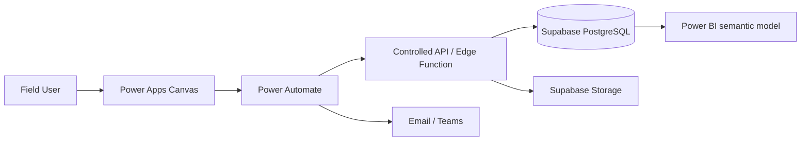

# Architecture Overview

## Architecture ที่แนะนำ

เริ่มต้นด้วย **Power Apps + Power Automate + Supabase**: Power Apps เหมาะกับการสร้าง mobile-first UI ในองค์กร, Power Automate ทำหน้าที่ integration/orchestration และ Supabase เป็น relational backend ที่ควบคุมด้วย PostgreSQL, Auth, Storage และ RLS

## Data Flow

1. ผู้ใช้กรอก Repair Request และแนบภาพใน Power Apps
2. Flow ตรวจสอบ input, สร้าง Ticket และเรียก API ด้วย identity ที่เหมาะสม
3. API บันทึกข้อมูลลง PostgreSQL และสร้าง event ใน Status History
4. รูปถูกเก็บใน private bucket โดยเก็บเฉพาะ object path ในฐานข้อมูล
5. Power BI อ่านผ่าน reporting view หรือ replica ตามข้อกำหนดด้าน performance

## Security Boundary

`anon key` ไม่ใช่ secret แต่ทุก request ต้องถูกจำกัดด้วย RLS ส่วน `service_role key` bypass RLS และต้องอยู่ใน server-side secret store เท่านั้น ห้ามใส่ใน Power Apps formula, browser bundle, GitHub Actions log หรือเอกสารตัวอย่าง

## เปรียบเทียบทางเลือก

| Architecture | เหมาะกับ | จุดเด่น | ข้อจำกัด |
| --- | --- | --- | --- |
| Power Apps + SharePoint | Prototype / ทีม Microsoft 365 | เริ่มเร็วและดูแลง่าย | relational complexity และ scale มีข้อจำกัด |
| Power Apps + Supabase | Department / field work | UI เร็ว + backend ยืดหยุ่น | ต้องออกแบบ API และ security เอง |
| Custom Web/Mobile + Supabase + Power BI | Enterprise / product | ควบคุม UX และ scale ได้สูง | ใช้ทักษะและเวลาพัฒนามากกว่า |
