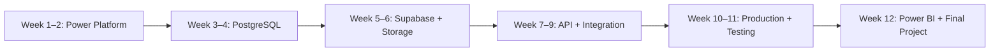

# CMMS Learning Roadmap

ยินดีต้อนรับสู่คู่มือสร้าง CMMS แบบครบเส้นทาง ตั้งแต่การออกแบบงานซ่อมจนถึง Dashboard

เริ่มเรียนอย่างไร

1. อ่าน <a href="/introduction/">บทนำ</a> 
2. เปิด <a href="/curriculum">Roadmap 12 สัปดาห์</a> 
3. เลือก Week 1 แล้วทำตาม <strong>บทเรียนหลัก → Lab → Quiz → Troubleshooting</strong>

## ทางลัด

| ต้องการ | ไปที่ |
| --- | --- |
| ดูบทเรียนทั้ง 12 สัปดาห์ | [Roadmap 12 สัปดาห์](/curriculum) |
| เริ่มบทเรียนแรก | [Week 1](/week-01/) |
| ดูภาพรวมระบบ | [Architecture](/architecture/overview) |
| นำเว็บขึ้นออนไลน์ | [GitHub, Netlify และ Vercel](/deployment/github-netlify-vercel) |
| แก้บทเรียนเป็นรอบ ๆ | [วิธีแก้ไขและทำ Batch](/maintenance/editing-batches) |

## สร้างระบบแจ้งซ่อมที่ใช้งานได้จริง ตั้งแต่ Power Apps ถึง Supabase และ Power BI

คู่มือนี้เป็นเส้นทางเรียนรู้ 12 สัปดาห์สำหรับผู้เริ่มต้นด้าน Backend ที่มีพื้นฐานงานซ่อมบำรุงและ Microsoft 365 โดยค่อย ๆ เปลี่ยนจากระบบต้นแบบไปสู่ CMMS ที่มีฐานข้อมูล, API, การควบคุมสิทธิ์, Mobile workflow และ Dashboard

จุดเริ่มต้น

อ่าน <a href="/introduction/">บทนำ</a> ก่อน แล้วทำตาม <a href="/curriculum">Roadmap 12 สัปดาห์</a> ตามลำดับ

## สิ่งที่จะสร้าง

- Repair Request และ Ticket Number
- Work Order พร้อม Status History
- Asset และ Equipment Master Data
- รูป Before / During / After Repair พร้อม metadata
- RLS และ API ที่ปกป้องข้อมูล
- Dashboard สำหรับ Technician, Supervisor และผู้บริหาร

## เส้นทางลัด

| ต้องการ | เริ่มที่ |
| --- | --- |
| เข้าใจภาพรวมระบบ | [บทนำ](/introduction/) |
| ดูแผนเรียนทั้งหมด | [Curriculum](/curriculum) |
| เริ่มลงมือทำ | [Week 1](/week-01/) |
| เข้าใจ component และ data flow | [Architecture](/architecture/overview) |
| Deploy เว็บไซต์คู่มือ | [GitHub Pages](/deployment/github-pages) |

## สิ่งที่เพิ่มในชุด CMMS ฉบับเต็ม

- [บทเรียน Week 1–12](/curriculum) พร้อม Lab, Mini Project และ Assessment
- [Database Assets](/database/) พร้อม PostgreSQL migration, seed, view, trigger และ RLS policy
- [API Assets](/api/) พร้อม REST examples, JSON schema และ Postman collection
- [Use Case Catalog](/use-cases/) จำนวน 20 กรณีจากงานซ่อมบำรุงจริง
- [Security Checklist](/security/checklist) และ [Test Cases](/testing/test-cases) ก่อน Production
- [Final Project Requirements](/final-project/requirements) สำหรับสร้างระบบ CMMS แบบ End-to-End

## ลำดับการเรียนแนะนำ

