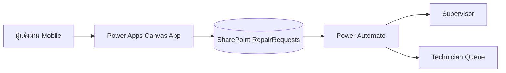

# Week 1 — CMMS, SharePoint และ Power Apps Foundations

## บทนี้จะได้เรียนรู้อะไร

เมื่อจบบทนี้ ผู้เรียนสามารถอธิบายวงจรงาน CMMS, แยก Master Data กับ Transaction, ออกแบบ SharePoint List สำหรับ Repair Request, สร้าง Canvas App แบบ mobile-first และตรวจสอบข้อมูลก่อนบันทึกได้

## ปัญหาที่ต้องการแก้

การแจ้งซ่อมผ่านโทรศัพท์ แชต และไฟล์ Excel ทำให้ไม่มีเลขอ้างอิงกลาง ไม่รู้ว่าใครรับงาน และค้นหาประวัติ Asset ได้ยาก เราจะสร้าง prototype ที่ทำให้ผู้แจ้งส่งข้อมูลเข้ากระบวนการเดียว โดยยังไม่อ้างว่าเป็น Production backend

## แนวคิดพื้นฐาน

### Master Data และ Transaction

**Master Data** คือข้อมูลอ้างอิงที่เปลี่ยนไม่บ่อย เช่น Site, Asset, Equipment และ Technician ส่วน **Transaction** คือเหตุการณ์ที่เกิดตามเวลา เช่น Ticket และ Work Order ใน CMMS ไม่ควรพิมพ์ชื่อ Asset เป็น text อิสระทุกครั้ง เพราะจะทำให้ข้อมูลซ้ำและทำรายงานเสีย

### SharePoint Column ที่ใช้

| Column | ความหมาย | ใช้ใน CMMS | ข้อควรระวัง |
| --- | --- | --- | --- |
| Choice | ค่าที่เลือกจากชุดจำกัด | Priority, Status | ต้องควบคุมค่าให้ตรงกับ backend |
| Lookup | อ้างอิงรายการอื่น | Site, Asset | ตรวจ delegation และการลบรายการอ้างอิง |
| Person | ผู้ใช้ Microsoft 365 | Reporter, Assignee | อย่าใช้แทน role authorization ทั้งระบบ |
| Date/Time | เวลาเหตุการณ์ | ReportedAt, DueAt | กำหนด timezone ให้ชัด |
| Attachment | หลักฐานเบื้องต้น | รูปอาการเสีย | ต้องจำกัดชนิด/ขนาดไฟล์ |

### Business Process

Prototype นี้ใช้สถานะ `New → Submitted → Assigned → In Progress → Completed → Verified → Closed` ส่วน `Critical` ต้องแจ้ง Supervisor และไม่ควรให้ผู้แจ้งปิดงานเอง

## Architecture



### หน้าที่และ Data Flow

1. Power Apps รับ input และแสดง validation ที่ผู้ใช้เข้าใจได้
2. SharePoint เก็บ prototype transaction และ attachment
3. Power Automate route งานและส่ง notification
4. Supervisor/Technician ดำเนินงานตามสถานะ
5. ใน Phase ต่อไปข้อมูล transaction จะย้ายไป PostgreSQL/Supabase เพื่อใช้ constraints, RLS, API และ reporting view

## Step-by-Step

### 1. สร้าง SharePoint Lists

สร้าง List ต่อไปนี้ใน Development site:

**RepairRequests:** `Title`, `ReportedAt`, `Reporter`, `Department`, `Site`, `FunctionalLocation`, `Asset`, `ProblemCategory`, `Description`, `Priority`, `Impact`, `Assignee`, `DueAt`, `Status`, `Latitude`, `Longitude`

**Assets:** `AssetCode`, `EquipmentNumber`, `Description`, `Site`, `FunctionalLocation`, `Manufacturer`, `Model`, `SerialNumber`, `Criticality`, `CurrentStatus`

ตั้ง Required ให้ `Description`, `Site`, `ProblemCategory` และ `Priority`; ตั้งค่าเริ่มต้น `Status = New` และห้ามใช้ Production list ในการทดลอง

### 2. สร้าง Canvas App

สร้าง Phone layout แล้วเพิ่มหน้าจอ `scrHome`, `scrNewRequest`, `scrMyRequests` และ `scrRequestDetail` โดยใช้ Form สำหรับ write และ Gallery สำหรับรายการ

### 3. ค้นหาและกรองรายการ

```powerfx
SortByColumns(
    Filter(
        RepairRequests,
        (IsBlank(txtSearch.Text) || StartsWith(Title, txtSearch.Text)) &&
        (IsBlank(ddStatus.Selected.Value) || Status.Value = ddStatus.Selected.Value)
    ),
    "ReportedAt",
    SortOrder.Descending
)
```

สูตรนี้ช่วยกรองรายการตาม Ticket และ Status แต่ต้องตรวจ delegation warning เมื่อข้อมูลมากกว่า limit ของ connector

### 4. ตรวจสอบและบันทึก Form

```powerfx
If(
    Or(
        IsBlank(ddSite.Selected.Value),
        IsBlank(ddProblem.Selected.Value),
        IsBlank(txtDescription.Text),
        IsBlank(ddPriority.Selected.Value)
    ),
    Notify("กรุณากรอก Site, ประเภทปัญหา, รายละเอียด และความเร่งด่วน", NotificationType.Error),
    SubmitForm(frmRepairRequest)
)
```

ตั้ง `OnSuccess` ของ Form เป็น `Notify("สร้างรายการแจ้งซ่อมแล้ว", NotificationType.Success); Navigate(scrMyRequests)` และ `OnFailure` เป็น `Notify("บันทึกไม่สำเร็จ: " & frmRepairRequest.Error, NotificationType.Error)`

### 5. รองรับ Mobile Location

```powerfx
Set(varLocation, Location);
Patch(
    RepairRequests,
    frmRepairRequest.LastSubmit,
    {Latitude: varLocation.Latitude, Longitude: varLocation.Longitude}
)
```

ต้องแจ้งผู้ใช้ก่อนขอ location permission และเก็บพิกัดเฉพาะเมื่อจำเป็นต่อการทำงาน

## ตัวอย่าง Code และ Formula เพิ่มเติม

### สร้าง Draft Ticket Number

```powerfx
"DRAFT-" & Text(Now(), "yyyymmddhhmmss") & "-" & User().Email
```

ค่า draft ใช้แสดงบนหน้าจอเท่านั้น การสร้างเลข Ticket ที่ไม่ซ้ำจริงควรทำที่ backend หรือ Flow ที่มี concurrency control

### Reset Form

```powerfx
NewForm(frmRepairRequest);
Reset(txtDescription);
Reset(ddPriority);
Navigate(scrNewRequest)
```

## Use Case จริง: แจ้งซ่อมตู้ MDB

- **ผู้เกี่ยวข้อง:** ผู้ใช้งานพื้นที่, ช่างไฟฟ้า, Supervisor
- **Trigger:** พบกลิ่นไหม้หรืออุณหภูมิตู้ MDB สูงผิดปกติ
- **Input:** Site, Asset, อาการเสีย, Priority, รูปภาพ และตำแหน่ง
- **Process:** ผู้แจ้งส่งงาน → Flow แจ้ง Supervisor → assign ช่าง → ช่างรับงาน
- **Output:** Ticket ที่มี owner, due date และ status
- **Business Rule:** Critical ต้องแจ้ง Supervisor ทันที และห้ามเปลี่ยนเป็น Closed โดยผู้แจ้ง
- **Exception:** ข้อมูลไม่ครบ, network หลุด, รูปใหญ่เกิน limit หรือ Asset ไม่ active
- **KPI:** Response Time, Assignment Time และ SLA Compliance

## แบบฝึกหัด

### Exercise 1 — ออกแบบ Data Dictionary

1. **เป้าหมาย:** ระบุ field, type, required และ owner ของข้อมูล
2. **เตรียม:** SharePoint Development site และรายการ Asset ตัวอย่าง
3. **ขั้นตอน:** วาดตาราง `RepairRequests`, ตั้ง choice values และกำหนดผู้ดูแลแต่ละ field
4. **Code/Formula:** ใช้ validation formula ในบทนี้
5. **Expected Result:** ผู้เรียนอธิบายได้ว่า field ใดเป็น master/transaction
6. **ตรวจสอบ:** ตรวจ Required column และลองส่งข้อมูลว่าง
7. **ปัญหา:** Lookup ไม่แสดงข้อมูลหรือเกิด delegation warning
8. **แก้ไข:** ตรวจชนิด column, datasource และลด query ให้กรองที่ server
9. **Challenge:** เพิ่ม `FunctionalLocation` เป็น lookup ที่สัมพันธ์กับ Site

### Exercise 2 — สร้างหน้าจอ Mobile

สร้าง Gallery รายการแจ้งซ่อม, Form แจ้งงานใหม่ และ Detail screen โดยทดสอบหน้าจอกว้าง 390 px; ผลลัพธ์ต้องอ่านง่ายและปุ่ม Submit ไม่ถูกบังด้วย keyboard

## Mini Project: Repair Request Prototype

### Requirement

สร้าง prototype ที่ให้ผู้ใช้สร้างและค้นหา Repair Request พร้อม priority, Site, Asset, รูปภาพ และ location

### User Story

ในฐานะผู้ใช้งานพื้นที่ ฉันต้องการแจ้งอุปกรณ์เสียจากมือถือ เพื่อให้ทีมซ่อมรับงานและติดตามสถานะได้

### Acceptance Criteria

- ไม่สามารถส่งเมื่อ field สำคัญว่าง
- รายการใหม่มี `ReportedAt`, Reporter และ Status
- ผู้แจ้งค้นหารายการของตนเองได้
- Critical แสดงข้อความแจ้งเตือน Supervisor
- ใช้งานได้ทั้ง desktop และ phone layout

### Data Model

ใช้ `RepairRequests` และ `Assets` ตามรายการ column ในบทนี้ โดย Asset ถูกเลือกจาก master ไม่พิมพ์ซ้ำ

### Workflow

`New → Submitted`; Flow แจ้ง Supervisor/Technician และบันทึกเวลาการส่ง

### Implementation Steps

1. สร้าง Lists และ sample data
2. สร้าง Canvas screens
3. ผูก Form/Gallery กับ datasource
4. เพิ่ม validation, location และ attachment
5. สร้าง Flow notification
6. ทดสอบบน mobile

### Test Cases

ทดสอบ Create Ticket, Required Field, Invalid Priority, Duplicate Submission, Mobile Layout และ Critical Notification

### Expected Output

มี prototype ที่สร้างรายการจริงใน Development site และมีหลักฐาน screenshot/ผลทดสอบครบ

### Definition of Done

ผู้เรียนสามารถสาธิตการสร้าง ค้นหา และตรวจสถานะ Ticket ได้ พร้อมอธิบายข้อจำกัดของ SharePoint prototype และเหตุผลที่จะย้ายไป PostgreSQL/Supabase

## Common Mistakes

- ใช้ SharePoint List เดียวเก็บ Asset, Ticket และรูปทั้งหมด
- ใช้ Text แทน Choice/Lookup ทำให้ค่าซ้ำ
- สร้าง Ticket Number ด้วย `Now()` อย่างเดียวจนเกิด collision
- ไม่ตรวจ delegation warning
- ฝัง secret หรือ service role key ใน Power Apps
- เปิด attachment โดยไม่จำกัด file type และ size
- ให้ผู้ใช้ทุกคนแก้ Status ได้ทุกค่า

## Best Practices

- เริ่มจาก business process ก่อนออกแบบหน้าจอ
- แยก Development/Test/Production
- ใช้ role และ owner ที่ชัดเจน
- ตรวจข้อมูลซ้ำที่ backend เมื่อย้ายระบบ
- เก็บข้อมูลส่วนบุคคลและพิกัดเท่าที่จำเป็น
- บันทึก decision และ assumption ใน repository

## Troubleshooting

| อาการ | สาเหตุที่พบบ่อย | วิธีแก้ |
| --- | --- | --- |
| Gallery แสดงไม่ครบ | delegation/limit | ใช้ Filter ที่รองรับ delegation และทดสอบกับข้อมูลจริง |
| Submit ไม่ผ่าน | Required column หรือ connection | ตรวจ Form.Error, datasource และ permission |
| Flow ไม่ทำงาน | trigger/filter ผิด | ทดสอบ Run History และ connection reference |
| รูปหาย | attachment policy/permission | ตรวจ List attachment และ user permission |
| Location เป็นค่าว่าง | ไม่ได้รับ permission | แจ้งผู้ใช้และจัดการกรณีปฏิเสธ permission |

## Checklist

- [ ] Data Dictionary มี field/type/required/owner
- [ ] SharePoint Lists แยก Master Data และ Transaction
- [ ] Canvas App มี New, List และ Detail screens
- [ ] Validation และ Error Handling ทำงาน
- [ ] Critical notification ถูกทดสอบ
- [ ] Mobile layout ไม่บังปุ่ม
- [ ] ไม่มี secret ในสูตรหรือไฟล์
- [ ] มี screenshot และ test evidence

## สรุป

Week 1 สร้างรากฐานจาก workflow จริงและ prototype ที่ผู้เรียนเห็นผลเร็ว แต่ยังรักษาขอบเขตว่า SharePoint เป็นจุดเริ่มต้น ไม่ใช่คำตอบเดียวสำหรับข้อมูล relational ขนาดใหญ่

## คำถามทบทวน

1. Master Data ต่างจาก Transaction อย่างไร
2. ทำไม Asset ควรเป็น Lookup
3. Choice column มีประโยชน์อย่างไร
4. Delegation warning หมายถึงอะไร
5. `SubmitForm` ต่างจาก `Patch` อย่างไร
6. ทำไม Ticket Number จาก `Now()` อย่างเดียวอาจซ้ำ
7. Critical ticket ควร route อย่างไร
8. ทำไมต้องแยก Development กับ Production
9. Location data มีข้อควรระวังอะไร
10. เมื่อใดควรย้ายจาก SharePoint ไป PostgreSQL/Supabase
