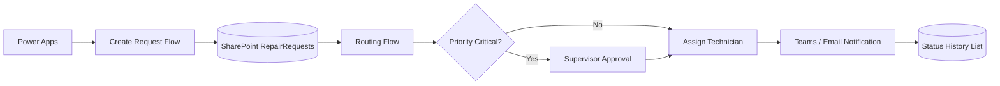

# Week 2 — Power Apps Workflow และ Power Automate

## บทนี้จะได้เรียนรู้อะไร

เมื่อจบบทนี้ ผู้เรียนสามารถสร้าง Ticket Number ที่ควบคุมจาก Flow, ออกแบบ status transition, ส่งงานให้ Supervisor/Technician, สร้าง Approval สำหรับงาน Critical, จัดการ error และทดสอบ duplicate submission ได้

## ปัญหาที่ต้องการแก้

Week 1 สร้างรายการแจ้งซ่อมได้แล้ว แต่ยังไม่มีการส่งงานอย่างเป็นระบบ ไม่มี SLA notification และผู้ใช้สามารถเปลี่ยนสถานะข้ามขั้นตอนได้ง่าย Week 2 จึงเพิ่ม workflow ที่ทำให้ทุกเหตุการณ์มี owner, timestamp และหลักฐานตรวจสอบย้อนหลัง

## แนวคิดพื้นฐาน

### Workflow และ State Transition

สถานะไม่ใช่เพียงสีบนหน้าจอ แต่เป็น state machine ที่กำหนดว่าใครทำอะไรต่อได้:

| Current Status | Allowed Next Status | ผู้ทำ |
| --- | --- | --- |
| New | Submitted, Cancelled | Requester |
| Submitted | Assigned, Cancelled | Supervisor |
| Assigned | Accepted, Cancelled | Technician |
| Accepted | In Progress | Technician |
| In Progress | Waiting for Material, Waiting for Vendor, Completed | Technician |
| Completed | Verified | Supervisor |
| Verified | Closed | Supervisor |

> **Warning:** การซ่อนปุ่มใน Power Apps ไม่ใช่ authorization ต้องตรวจสิทธิ์ซ้ำที่ Flow, API หรือ database เมื่อย้ายไป Supabase

### Ticket Number

Ticket Number เป็น business identifier ที่ผู้ใช้ใช้สื่อสารกัน ควรมีรูปแบบอ่านง่าย เช่น `CMMS-20260719-0001` และต้องสร้างในจุดที่ควบคุม concurrency ได้ ไม่ควรใช้ `Now()` จาก client เป็นเลขถาวร เพราะผู้ใช้หลายคนอาจส่งพร้อมกัน

### Approval และ Notification

Approval ใช้เมื่อมีกฎว่าต้องมีคนอนุมัติ เช่น Critical work, vendor cost หรือการปิดงาน ส่วน notification เป็นการแจ้งเหตุการณ์ ไม่ควรถูกใช้แทน permission

## Architecture



### Data Flow และหน้าที่ของ Component

1. Power Apps ตรวจ required fields และส่ง payload ที่มี `ClientRequestId`
2. Create Request Flow ตรวจ duplicate แล้วสร้าง Ticket
3. Routing Flow ตรวจ priority, คำนวณ SLA และเลือก approval/assignment
4. Status History List เก็บ `from_status`, `to_status`, `changed_by`, `changed_at` และ note
5. Notification แจ้งผู้เกี่ยวข้องโดยไม่ส่งข้อมูลส่วนบุคคลเกินจำเป็น

## Step-by-Step

### 1. เพิ่ม Columns สำหรับ Workflow

ใน `RepairRequests` เพิ่ม `TicketNumber`, `ClientRequestId`, `SubmittedAt`, `AssignedAt`, `AcceptedAt`, `CompletedAt`, `VerifiedAt`, `ClosedAt`, `SlaDueAt` และ `LastError` สร้าง `StatusHistory` แยกเป็นรายการใหม่เพื่อไม่ให้ข้อมูลประวัติถูกเขียนทับ

### 2. สร้าง Client Request ID

```powerfx
Set(varClientRequestId, GUID());
Set(varSubmitting, true);
Patch(RepairRequests, Defaults(RepairRequests), {ClientRequestId: Text(varClientRequestId), Description: txtDescription.Text, Priority: {Value: ddPriority.Selected.Value}, Status: {Value: "New"}})
```

ID นี้ช่วยให้ Flow ตรวจได้ว่าการกด Submit ซ้ำคือ request เดิม ไม่ใช่ Ticket ใหม่

### 3. สร้าง Ticket Number ด้วย Power Automate

ออกแบบ Flow `Create Ticket Number`: Trigger เมื่อมี item ถูกสร้าง → ตรวจ `ClientRequestId` → สร้างเลขจาก `TicketCounters` → อัปเดต TicketNumber/SubmittedAt/Status → สร้าง StatusHistory → เรียก Routing Flow

ใน Production ให้ใช้ database sequence หรือ API transaction เมื่อมีผู้ใช้จำนวนมาก เพราะ SharePoint counter ต้องออกแบบ concurrency เพิ่มเติม

### 4. คำนวณ SLA

```text
Critical → SubmittedAt + 2 ชั่วโมง
Urgent   → SubmittedAt + 8 ชั่วโมง
Normal   → SubmittedAt + 2 วันทำการ
Low      → SubmittedAt + 5 วันทำการ
```

ต้องระบุ timezone และปฏิทินวันทำการให้ชัด และเก็บค่าที่คำนวณแล้วเพื่อ audit

### 5. ควบคุม Status Transition

ก่อนอัปเดต Status ให้ Flow อ่าน current status แล้วตรวจคู่ค่า `current → requested` จาก transition table หากไม่อนุญาตให้จบด้วย error ที่อธิบายได้และไม่สร้าง Status History

### 6. สร้าง Approval สำหรับ Critical

ใช้ Power Automate Approvals: Critical → Supervisor approval → Approve เปลี่ยนเป็น Assigned และแจ้ง Technician; Reject คืน Submitted พร้อมเหตุผล; Timeout แจ้ง Maintenance Manager

## ตัวอย่าง Code และ Formula

### แสดงปุ่มตามสถานะและบทบาท

```powerfx
varCurrentUserRole = "Supervisor" && ThisItem.Status.Value = "Submitted"
```

สูตรนี้ควบคุม UX เท่านั้น ต้องมี Flow/API ตรวจซ้ำก่อนเขียนข้อมูล

### แสดง SLA สีตามเวลาที่เหลือ

```powerfx
If(ThisItem.Status.Value = "Closed", Color.Green, ThisItem.SlaDueAt < Now(), Color.Red, DateDiff(Now(), ThisItem.SlaDueAt, TimeUnit.Hours) <= 2, Color.Orange, Color.Green)
```

### Error Handling หลัง Submit

```powerfx
IfError(SubmitForm(frmRepairRequest), Notify("ระบบบันทึกไม่สำเร็จ กรุณาลองใหม่", NotificationType.Error), Notify("รับเรื่องแล้ว รอการจัดเลข Ticket", NotificationType.Success))
```

อย่าแสดง error ภายในที่มี secret หรือ connection detail ให้ผู้ใช้ ให้เขียนไว้ใน secure run log แทน

## Use Case จริง: Assign Technician งานเร่งด่วน

- **Actor:** Supervisor, Technician และ Power Automate
- **Preconditions:** Ticket อยู่ `Submitted`, มี Site และ Priority
- **Trigger:** Flow ตรวจพบรายการใหม่
- **Input:** Ticket Number, Asset, Priority, SLA due time และ technician queue
- **Main Flow:** ตรวจ transition → Critical approval → เลือกช่าง → อัปเดต `Assigned` → แจ้งช่าง
- **Alternative Flow:** ไม่มีช่างว่าง → `Waiting for Approval` หรือ Vendor queue
- **Exception Flow:** duplicate, permission error, approval timeout หรือ notification failure
- **Business Rules:** ผู้แจ้งไม่ assign งานให้ตนเองโดยตรง
- **Data Used:** RepairRequests, StatusHistory, Technician directory และ Approval response
- **Security:** จำกัด Supervisor ตาม Site และไม่ส่งข้อมูลเกินสิทธิ์ใน Teams card
- **Acceptance Criteria:** ช่างเห็นงานใหม่, history มีผู้ assign/เวลา, SLA timer เริ่มนับ
- **KPI:** Assignment Time, SLA Compliance และ Technician Workload

## แบบฝึกหัด

### Exercise 1 — Status Transition Matrix

1. **เป้าหมาย:** ป้องกันการเปลี่ยนสถานะข้ามขั้น
2. **เตรียม:** Status Choice และตาราง transition
3. **ขั้นตอน:** สร้าง `StatusTransitions` list, เพิ่ม current/requested/role/allowed และสร้าง Flow ตรวจสอบ
4. **Code/Formula:** ใช้ปุ่ม Status และ transition table ในบทนี้
5. **Expected Result:** `New → Closed` ถูกปฏิเสธ แต่ `Completed → Verified` ผ่านเมื่อ Supervisor ทำ
6. **ตรวจสอบ:** ทดสอบด้วย requester, technician และ supervisor
7. **ปัญหา:** Flow อัปเดตวนซ้ำจาก trigger ของตนเอง
8. **วิธีแก้:** ใช้ trigger condition และ flag `LastAutomationAction`
9. **Challenge:** เพิ่ม Cancel reason ที่ required เมื่อเปลี่ยนเป็น Cancelled

### Exercise 2 — Critical Approval

สร้าง Flow ที่ต้อง Approve งาน Critical, Reject แล้วคืน Submitted และ Timeout แล้วแจ้ง Manager พร้อมเก็บ approval response ใน history

## Mini Project: Controlled Repair Workflow

### Requirement

ต่อยอด Week 1 ให้มี Ticket Number, SLA, status transition, assignment, approval และ notification ที่ตรวจสอบย้อนหลังได้

### User Story

ในฐานะ Supervisor ฉันต้องการให้ระบบ route งานตาม priority และ role เพื่อให้ Critical ticket ได้รับการตอบสนองทัน SLA

### Acceptance Criteria

- Ticket Number ไม่ซ้ำเมื่อกด Submit ซ้ำ
- Critical ต้องเข้า Approval ก่อน Assignment
- Status ที่ไม่อยู่ใน transition matrix ถูกปฏิเสธ
- ทุก transition มี Status History
- Flow failure แจ้งผู้ดูแลและไม่ทำให้ข้อมูลอยู่ในสถานะครึ่งทาง

### Data Model

`RepairRequests`, `StatusHistory`, `StatusTransitions`, `TicketCounters` และ `TechnicianDirectory`

### Workflow

`New → Submitted → [Approval หาก Critical] → Assigned → Accepted → In Progress → Completed → Verified → Closed`

### Implementation Steps

1. เพิ่ม columns และ lists
2. สร้าง transition matrix
3. เพิ่ม `ClientRequestId`
4. สร้าง Create Ticket Flow
5. สร้าง Routing/Approval Flow
6. สร้าง Status History Flow
7. เพิ่ม SLA reminder และ escalation
8. ทดสอบ duplicate, reject, timeout และ permission

### Test Cases

Create Ticket, Duplicate Submission, Critical Approval, Reject, Approval Timeout, Unauthorized Status Change, Assignment, SLA Reminder และ Notification Failure

### Expected Output

มี workflow ที่ผู้เรียนสาธิตได้ตั้งแต่ Submit จน Assigned พร้อมแสดง Ticket Number, SLA due time และ Status History

### Definition of Done

Flow ทำงานครบใน Development environment, มี test evidence, มี owner ของ failure alert และมีรายการข้อจำกัดก่อนย้ายไป PostgreSQL/Supabase

## Common Mistakes

- ใช้ `Now()` จาก client เป็น Ticket Number ถาวร
- ทำ approval แต่ไม่มี timeout/escalation
- อัปเดต Status ก่อนตรวจ current status
- Flow trigger ตัวเองวนซ้ำ
- Retry POST โดยไม่มี idempotency key
- แจ้ง Sensitive Data ใน Teams card
- ใช้ connection ของผู้สร้าง Flow แทน connection reference

## Best Practices

- เก็บ request ID และ correlation ID ทุก Flow
- แยก Create, Route, Approval และ Notification เป็น Flow ที่มีหน้าที่ชัดเจน
- ใช้ environment variables และ connection references
- เขียน status history แบบ append-only
- ให้ backend เป็น source of truth เมื่อระบบโตขึ้น
- วัด Flow duration และ failure rate เป็น operational KPI

## Troubleshooting

| อาการ | สาเหตุที่พบบ่อย | วิธีแก้ |
| --- | --- | --- |
| Ticket ซ้ำ | ไม่มี idempotency/concurrency control | ใช้ ClientRequestId และ unique constraint |
| Flow วนซ้ำ | trigger จากการ update ตัวเอง | เพิ่ม trigger condition/automation flag |
| Approval ไม่ถึงคน | owner mapping ผิด | ตรวจ Site-to-Supervisor mapping |
| Status ข้ามขั้น | ตรวจเฉพาะปุ่มใน client | ตรวจ transition ใน Flow/API |
| SLA ผิดเวลา | timezone/วันทำการไม่ชัด | ใช้ UTC และ calendar rule เดียวกัน |
| Notification ล้มเหลว | connector/recipient ผิด | แยก notification retry จาก transaction |

## Checklist

- [ ] Ticket Number มีการควบคุมไม่ให้ซ้ำ
- [ ] มี ClientRequestId และ duplicate test
- [ ] มี status transition matrix
- [ ] Critical มี approval/reject/timeout
- [ ] มี SLA calculation และ reminder
- [ ] มี Status History ทุก transition
- [ ] มี retry/error handling ที่เหมาะสม
- [ ] ไม่มี secret ใน Formula, Flow หรือ sample payload
- [ ] แยก Development connection จาก Production

## สรุป

Week 2 เปลี่ยน prototype ให้เป็น workflow ที่ควบคุมได้ โดยให้ Ticket Number, SLA, Approval, Assignment และ Status History เป็นข้อมูลที่ตรวจสอบย้อนหลังได้ การควบคุมที่เริ่มจาก Flow จะถูกย้ายไป database/API ใน Phase ถัดไปเมื่อระบบต้องการ consistency และ scale สูงขึ้น

## คำถามทบทวน

1. ทำไม Ticket Number จาก client จึงเสี่ยงซ้ำ
2. Idempotency key ช่วยอะไร
3. ทำไมซ่อนปุ่ม Status ไม่เพียงพอ
4. Approval ต่างจาก authorization อย่างไร
5. Critical timeout ควรทำอะไร
6. Status History ควรเก็บแบบใด
7. ทำไมต้องแยก Flow เป็นหลายหน้าที่
8. SLA ต้องระบุ timezone และ calendar เพราะอะไร
9. Retry แบบใดไม่ควรทำกับ validation error
10. เมื่อใดควรย้าย workflow ไป backend/database
