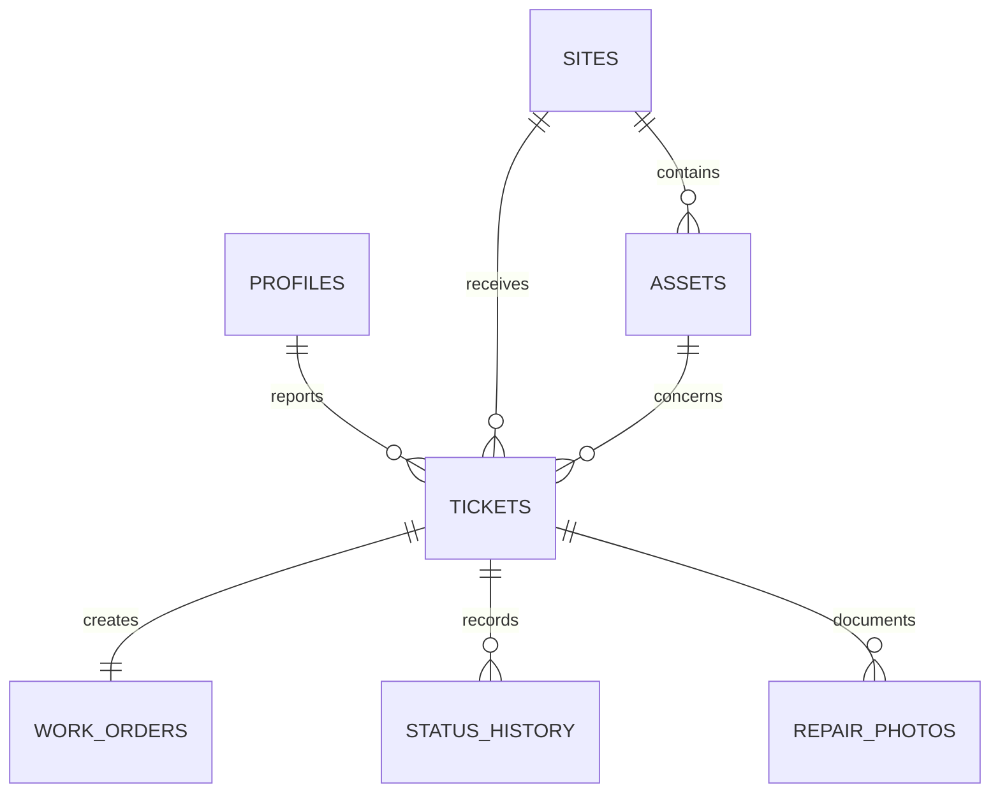

# Week 3 — PostgreSQL Fundamentals และ Database Design

## บทนี้จะได้เรียนรู้อะไร

เมื่อจบบทนี้ ผู้เรียนสามารถอธิบาย relational database, ออกแบบ table และ relationship สำหรับ CMMS, เลือก data type, สร้าง Primary Key/Foreign Key/constraints และวาด ER Diagram ที่นำไปสร้างจริงได้

## ปัญหาที่ต้องการแก้

SharePoint prototype เหมาะกับการเริ่มต้น แต่ข้อมูล Asset, Ticket, Work Order และ History จะมีความสัมพันธ์กันมากขึ้นเมื่อระบบโตขึ้น หากเก็บทุกอย่างเป็น text หรือ table เดียว จะเกิดข้อมูลซ้ำ, update ไม่ครบ และทำรายงานผิด เราจะออกแบบ relational model ที่รักษาความถูกต้องของข้อมูลตั้งแต่ต้น

## แนวคิดพื้นฐาน

### Database และ Relational Database

Database คือแหล่งเก็บข้อมูลที่มีโครงสร้างและกฎการเข้าถึง ส่วน relational database จัดข้อมูลเป็น table และเชื่อม table ด้วย key ใน CMMS เราแยก master data เช่น Site/Asset จาก transaction เช่น Ticket/Work Order เพื่อให้แก้ข้อมูลอ้างอิงจุดเดียว

### Table, Row, Column และ Data Type

| แนวคิด | ความหมาย | ตัวอย่างใน CMMS | ข้อควรระวัง |
| --- | --- | --- | --- |
| Table | กลุ่มข้อมูลชนิดเดียวกัน | `assets` | อย่าเก็บหลาย business concept ใน table เดียว |
| Row | หนึ่ง instance | Asset หนึ่งรายการ | ต้องมี key ที่ไม่ซ้ำ |
| Column | คุณสมบัติของ row | `serial_number` | เลือก type ให้ตรงความหมาย |
| Data type | ชนิดข้อมูล | `date`, `numeric`, `uuid` | อย่าใช้ text แทนทุกอย่าง |

### Keys และ Constraints

- **Primary Key:** ระบุ row แบบไม่ซ้ำ แนะนำ `uuid` สำหรับ entity ที่สร้างจากหลาย client
- **Foreign Key:** บังคับให้ reference ไปยัง row ที่มีอยู่ เช่น `tickets.asset_id → assets.id`
- **UNIQUE:** ป้องกัน `asset_code` หรือ `ticket_number` ซ้ำ
- **NOT NULL:** บังคับ field ที่จำเป็นจริง
- **CHECK:** จำกัดค่า เช่น priority และ criticality
- **DEFAULT:** ใส่ค่าเริ่มต้น เช่น `created_at = now()`

### Relationship และ Normalization

CMMS มี Site หนึ่งแห่งมี Asset หลายรายการ (one-to-many), Ticket หนึ่งรายการมีรูปหลายรูป (one-to-many) และ Work Order หนึ่งรายการอาจมี Technician หลายคน (many-to-many) ซึ่งควรมี junction table แยกต่างหาก

Normalization ช่วยลด duplication: 1NF เก็บค่าเป็น atomic, 2NF ลด partial dependency และ 3NF ลด dependency ที่เกิดผ่าน column อื่น แต่ไม่ควร normalize จน query รายงานซับซ้อนโดยไม่มี view ที่ชัดเจน

## Architecture และ ER Diagram



### Data Flow

1. `sites` และ `assets` เป็น master data
2. `tickets` อ้างอิงผู้แจ้ง, Site และ Asset ด้วย foreign key
3. `work_orders` เก็บ execution detail ของ Ticket
4. `status_history` เก็บทุก transition แบบ append-only
5. `repair_photos` เก็บ metadata และ object path ไม่เก็บภาพเป็น Base64 ใน table

## Step-by-Step

### 1. ติดตั้ง PostgreSQL Client

ใช้ PostgreSQL Development instance หรือ Supabase project แยกจาก Production เตรียม SQL client เช่น Supabase SQL Editor, `psql` หรือ VS Code extension แล้วเก็บ migration ใน Git

### 2. สร้าง Schema แรก

```sql
-- Site เป็น master data ของสถานที่
create table sites (
  id uuid primary key,
  code text not null unique,
  name text not null,
  created_at timestamptz not null default now()
);

-- Asset อ้างอิง Site ด้วย foreign key
create table assets (
  id uuid primary key,
  site_id uuid not null references sites(id),
  asset_code text not null unique,
  description text not null,
  criticality smallint not null default 3 check (criticality between 1 and 5)
);
```

### 3. สร้าง Ticket และ Work Order

```sql
create table tickets (
  id uuid primary key,
  ticket_number text not null unique,
  site_id uuid not null references sites(id),
  asset_id uuid references assets(id),
  description text not null,
  priority text not null check (priority in ('low','normal','urgent','critical')),
  reported_at timestamptz not null default now()
);

create table work_orders (
  id uuid primary key,
  ticket_id uuid not null unique references tickets(id),
  repair_result text,
  completed_at timestamptz
);
```

`work_orders.ticket_id unique` ทำให้ตัวอย่างนี้เป็น one-to-one; หากธุรกิจอนุญาตหลาย Work Order ต่อ Ticket ให้เอา unique ออกและเพิ่ม `work_order_number`

### 4. ตรวจความสัมพันธ์ด้วย JOIN

```sql
-- แสดง Ticket พร้อม Site และ Asset
select
  t.ticket_number,
  s.code as site_code,
  a.asset_code,
  t.priority,
  t.reported_at
from tickets t
join sites s on s.id = t.site_id
left join assets a on a.id = t.asset_id
order by t.reported_at desc;
```

## ตัวอย่าง Code และ SQL

### สร้าง Ticket ด้วย Transaction

```sql
begin;

insert into tickets (id, ticket_number, site_id, asset_id, description, priority)
values (gen_random_uuid(), 'T-DEMO-0001', :site_id, :asset_id, :description, :priority);

-- ถ้าคำสั่งใดล้มเหลว ให้ rollback ทั้งชุด ไม่ทิ้งข้อมูลครึ่งทาง
commit;
```

### ตรวจข้อมูลซ้ำก่อน Migration

```sql
select asset_code, count(*) as duplicate_count
from assets
group by asset_code
having count(*) > 1;
```

## Use Case จริง: Asset เสียซ้ำ

- **Actor:** Maintenance Planner และ Database
- **Preconditions:** มี Asset master และ Ticket history
- **Trigger:** ผู้จัดการต้องการตรวจอุปกรณ์ที่เสียซ้ำ
- **Input:** Asset ID, problem category, reported_at และ closed_at
- **Main Flow:** join Ticket กับ Asset → group ตาม Asset → นับเหตุการณ์ → เรียงจากมากไปน้อย
- **Alternative Flow:** Ticket บางรายการไม่มี Asset → จัดเป็น unclassified และส่งให้ data steward
- **Exception Flow:** foreign key หาย, วันที่ผิด type หรือข้อมูลซ้ำจาก migration
- **Business Rule:** Asset code ต้อง unique และ Ticket ที่ soft delete ไม่รวมในรายงาน
- **Data Used:** `sites`, `assets`, `tickets`, `status_history`
- **Security:** reporting user อ่านผ่าน view ที่จำกัด column ไม่ใช้ table ตรง ๆ
- **Acceptance Criteria:** ผลลัพธ์ระบุ Asset ที่เสียซ้ำและจำนวน Ticket ที่ตรวจสอบย้อนกลับได้
- **KPI:** Repeat Failure Rate และ Top Failure Assets

## แบบฝึกหัด

### Exercise 1 — ออกแบบ Data Dictionary

1. **เป้าหมาย:** ระบุ table, column, type, required, key และคำอธิบาย
2. **สิ่งที่ต้องเตรียม:** Requirement ของ Repair Request และ Asset
3. **ขั้นตอน:** แยก entity, ระบุ relationship, เลือก type และวาง constraint
4. **Code:** ใช้ migration ตัวอย่างและเปลี่ยนชื่อ field ให้ตรง domain
5. **Expected Result:** ได้ dictionary ของ Site, Asset, Ticket และ Work Order
6. **วิธีตรวจสอบ:** ทุก foreign key มี parent table และทุก required field มีเหตุผล
7. **ปัญหาที่อาจพบ:** เก็บหลายค่าคั่นด้วย comma ใน column เดียว
8. **วิธีแก้ไข:** แยก child/junction table ตามความสัมพันธ์
9. **Challenge:** เพิ่ม Vendor และ Work Order Vendor Assignment แบบ many-to-many

### Exercise 2 — ER Diagram

วาด ER Diagram ของ CMMS และเขียนคำอธิบายว่าแต่ละ relationship เป็น one-to-one, one-to-many หรือ many-to-many พร้อมระบุ optional relationship

## Mini Project: CMMS Relational Schema

### Requirement

ออกแบบ schema สำหรับ Site, Asset, Ticket, Work Order, Status History และ Repair Photo ที่นำไปสร้างด้วย PostgreSQL ได้

### User Story

ในฐานะ Database Designer ฉันต้องการ schema ที่ลดข้อมูลซ้ำและบังคับความสัมพันธ์ เพื่อให้การค้นหาประวัติ Asset เชื่อถือได้

### Acceptance Criteria

- มี primary key ทุก table
- มี foreign key ตาม ER Diagram
- Asset Code และ Ticket Number ไม่ซ้ำ
- Priority/Criticality ใช้ check constraint
- วันที่ใช้ date/timestamptz ไม่ใช่ text
- มีตัวอย่าง JOIN ที่คืนข้อมูลถูกต้อง

### Data Model

ใช้ entity ใน `database/migrations/001_cmms_core.sql` และจัดทำ data dictionary เพิ่ม description, owner และ retention

### Workflow

Migration → seed data → constraint test → sample query → review ERD → version control

### Implementation Steps

1. วาด ERD
2. สร้าง migration ที่รันตามลำดับ
3. เพิ่ม constraints และ indexes ที่จำเป็น
4. เพิ่ม seed data ที่ไม่มีข้อมูลจริง
5. เขียน JOIN, GROUP BY และ duplicate checks
6. review กับ business owner

### Test Cases

Insert duplicate asset, insert ticket ที่ไม่มี Site, invalid priority, delete Site ที่มี Asset, valid join และ transaction rollback

### Expected Output

มี ER Diagram, migration, data dictionary, seed data และ SQL test ที่ผู้อื่นนำไปรันใน Development ได้

### Definition of Done

schema สร้างสำเร็จ, invalid data ถูกปฏิเสธ, relationship อธิบายได้ และไฟล์ทั้งหมดอยู่ใน repository โดยไม่มี credential จริง

## Common Mistakes

- ใช้ table เดียวเก็บทุก entity
- ใช้ text แทน date, numeric หรือ boolean
- ไม่มี foreign key เพราะกลัว insert error
- เก็บหลายค่าใน column เดียว
- ใช้ natural key ที่เปลี่ยนได้เป็น primary key
- ใช้ `select *` ใน reporting query
- ลบ parent row โดยไม่เข้าใจ cascade behavior
- ไม่มี migration versioning

## Best Practices

- ใช้ surrogate UUID เป็น internal key และ business code เป็น unique key
- กำหนด naming convention เป็น `snake_case`
- ใช้ UTC ใน `timestamptz`
- ใส่ comment ใน SQL migration ที่อธิบาย business rule
- แยก schema migration จาก seed data
- ทดสอบ constraint failure ด้วย ไม่ทดสอบเฉพาะ happy path
- ใช้ view สำหรับ consumer/reporting ที่ไม่ควรเห็น raw table

## Troubleshooting

| อาการ | สาเหตุที่พบบ่อย | วิธีแก้ |
| --- | --- | --- |
| foreign key error | parent row ไม่มี | seed parent ก่อน child และตรวจ ID |
| duplicate key | code ซ้ำหรือ retry | ตรวจข้อมูลก่อน insert และใช้ idempotency |
| date parse error | ส่ง text ไม่ตรง format | ใช้ ISO 8601 และ timestamptz |
| migration รันซ้ำแล้ว fail | ไม่มี idempotent pattern | ใช้ versioned migration และตรวจ schema ก่อนรัน |
| query ช้า | join/filter ไม่มี index | ใช้ EXPLAIN และเพิ่ม index ตาม access pattern |

## Checklist

- [ ] มี ER Diagram และ cardinality
- [ ] มี data dictionary
- [ ] ทุก table มี primary key
- [ ] ความสัมพันธ์มี foreign key
- [ ] มี UNIQUE/NOT NULL/CHECK/DEFAULT ที่เหมาะสม
- [ ] มี migration และ seed แยกกัน
- [ ] SQL มี comment และใช้ UTC
- [ ] ทดสอบ invalid data และ rollback
- [ ] ไม่มีข้อมูลจริงหรือ secret ใน seed

## สรุป

Week 3 วางรากฐาน database ที่ทำให้ CMMS เชื่อถือได้ การออกแบบที่ดีไม่ได้หมายถึงมี table มากที่สุด แต่หมายถึงแต่ละ table มีหน้าที่ชัด, relationship ตรวจสอบได้ และ query สำคัญทำงานได้ตามข้อมูลจริง

## คำถามทบทวน

1. Relational database ต่างจากการเก็บข้อมูลใน Excel อย่างไร
2. Primary Key และ Foreign Key ทำหน้าที่อะไร
3. ทำไม Asset Code ควร unique
4. One-to-many ใน CMMS มีตัวอย่างใด
5. Many-to-many ต้องใช้ table แบบใด
6. Normalization ช่วยแก้ปัญหาอะไร
7. ทำไมควรใช้ timestamptz
8. CHECK constraint ช่วยอะไร
9. Transaction สำคัญใน workflow ใด
10. เมื่อใดควรใช้ view แทนการเปิด raw table
