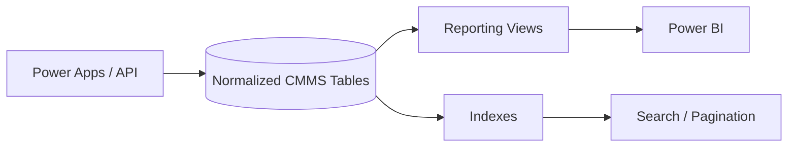

# Week 4 — SQL, Views, Indexes และ Query Performance

## บทนี้จะได้เรียนรู้อะไร

เมื่อจบบทนี้ ผู้เรียนสามารถเขียน SQL สำหรับค้นหาและสรุปข้อมูล CMMS, ใช้ `JOIN`, `WHERE`, `GROUP BY`, `ORDER BY`, CTE และ aggregate functions, ออกแบบ reporting view, เลือก index จาก access pattern และอ่านผล `EXPLAIN` เบื้องต้นได้

## ปัญหาที่ต้องการแก้

Schema ที่ถูกต้องยังไม่พอ หาก query ดึงข้อมูลทั้งหมดทุกครั้ง, join ผิด หรือสรุปสถานะไม่ตรงกับ business definition Dashboard จะช้าและตัวเลขไม่น่าเชื่อถือ Week 4 จึงเชื่อม SQL กับ use case จริง เช่น backlog, aging, SLA และ repeat failure

## แนวคิดพื้นฐาน

### SQL Command Groups

| กลุ่ม | คำสั่ง | ใช้ใน CMMS |
| --- | --- | --- |
| Query | `SELECT`, `WHERE`, `ORDER BY`, `LIMIT` | ค้นหา Ticket |
| Combine | `JOIN`, `UNION` | รวม Site/Asset/Work Order |
| Aggregate | `COUNT`, `SUM`, `AVG`, `MIN`, `MAX` | KPI และ backlog |
| Group | `GROUP BY`, `HAVING` | สรุปตาม Site/Technician |
| Change | `INSERT`, `UPDATE`, `DELETE` | transaction และ admin operation |
| Structure | `CREATE VIEW`, `CREATE INDEX` | reporting และ performance |

### View

View คือ query ที่เรียกเหมือน table ช่วยซ่อน join ซับซ้อนและทำให้ Power BI ใช้ semantic contract เดียวกัน ข้อจำกัดคือ view ปกติไม่ได้เก็บผลลัพธ์ถาวร และ query จะรันตาม underlying tables ทุกครั้ง

### Index

Index เป็นโครงสร้างช่วยค้นหา row โดยแลกกับ storage และต้นทุนตอน insert/update ใช้เมื่อ column อยู่ใน `WHERE`, `JOIN`, `ORDER BY` หรือมี access pattern ชัดเจน ไม่ควรสร้าง index ทุก column โดยไม่ดู query plan

### Transaction และ ACID

Transaction รวมหลายคำสั่งให้สำเร็จหรือ rollback เป็นชุดเดียว ใน CMMS ใช้เมื่อสร้าง Ticket พร้อม Work Order/History หรือปิดงานพร้อมบันทึกเวลาและผลซ่อม ต้องระวัง transaction ที่เปิดค้างนานเพราะทำให้ lock และระบบช้าลง

## Architecture



### Data Flow

1. Application เขียนข้อมูลผ่าน constraints/transaction
2. Query layer ใช้ index ตาม filter และ sort ที่เกิดจริง
3. Reporting view รวมข้อมูลเฉพาะ column ที่จำเป็น
4. Power BI อ่าน view และใช้ definition เดียวกับ operational report

## Step-by-Step

### 1. SELECT และ Filter งานค้าง

```sql
-- งานที่ยังไม่ปิดและไม่ถูก soft delete
select ticket_number, site_id, priority, status, reported_at
from public.tickets
where deleted_at is null
  and status <> 'closed'
order by reported_at asc
limit 100;
```

### 2. JOIN ข้อมูลสำหรับหน้าประวัติ Asset

```sql
select
  a.asset_code,
  a.description as asset_description,
  t.ticket_number,
  t.priority,
  t.status,
  t.reported_at,
  t.closed_at
from public.assets a
join public.tickets t on t.asset_id = a.id
where a.asset_code = :asset_code
  and t.deleted_at is null
order by t.reported_at desc;
```

### 3. GROUP BY และ HAVING

```sql
-- นับ backlog ตาม Site เฉพาะ Site ที่มีอย่างน้อย 1 งาน
select s.code as site_code, count(*) as backlog_count
from public.tickets t
join public.sites s on s.id = t.site_id
where t.deleted_at is null and t.status <> 'closed'
group by s.code
having count(*) > 0
order by backlog_count desc;
```

### 4. CTE สำหรับ Aging Bucket

```sql
with open_tickets as (
  select id, site_id, priority,
         extract(epoch from (now() - reported_at))/86400 as age_days
  from public.tickets
  where deleted_at is null and status not in ('closed', 'cancelled')
)
select
  case
    when age_days <= 7 then '0-7'
    when age_days <= 14 then '8-14'
    when age_days <= 30 then '15-30'
    else '31+'
  end as aging_bucket,
  count(*) as ticket_count
from open_tickets
group by aging_bucket
order by aging_bucket;
```

### 5. สร้าง Reporting View

```sql
create or replace view public.v_work_order_reporting as
select
  t.id as ticket_id,
  t.ticket_number,
  s.code as site_code,
  a.asset_code,
  t.priority,
  t.status,
  t.reported_at,
  t.closed_at,
  extract(epoch from (coalesce(t.closed_at, now()) - t.reported_at))/3600 as aging_hours
from public.tickets t
join public.sites s on s.id = t.site_id
left join public.assets a on a.id = t.asset_id
where t.deleted_at is null;
```

กำหนด grain และชื่อ column ของ view ให้คงที่ก่อนนำไปใช้กับ Power BI เพื่อไม่ให้ dashboard แตกเมื่อเปลี่ยน table ภายใน

### 6. ตรวจ Query Plan

```sql
explain (analyze, buffers)
select ticket_number, status, reported_at
from public.tickets
where site_id = :site_id
  and status = 'in_progress'
order by reported_at desc
limit 50;
```

อ่าน `Seq Scan`, `Index Scan`, estimated rows, actual rows และ execution time อย่างมีบริบท ห้ามเพิ่ม index เพียงเพราะเห็น `Seq Scan` หาก table ยังเล็กหรือ query scan ทั้ง table เหมาะสมกว่า

## ตัวอย่าง Code และ SQL เพิ่มเติม

### Pagination แบบ Keyset

```sql
-- ดึงหน้าถัดไปโดยใช้ reported_at/id แทน OFFSET ที่ช้าลงเมื่อหน้าลึก
select ticket_number, reported_at, id
from public.tickets
where (reported_at, id) < (:last_reported_at, :last_id)
  and deleted_at is null
order by reported_at desc, id desc
limit 50;
```

### Index ที่ตรง Access Pattern

```sql
create index if not exists tickets_site_status_reported_idx
on public.tickets (site_id, status, reported_at desc)
where deleted_at is null;
```

Partial index นี้เหมาะเมื่อ query ส่วนใหญ่ไม่เอา soft-deleted rows และ filter ตาม Site/Status

## Use Case จริง: SLA และ Backlog Dashboard

- **Actor:** Supervisor, Maintenance Manager และ Power BI
- **Preconditions:** Ticket มี `reported_at`, `due_at`, `status` และ Site
- **Trigger:** เปิด dashboard รายวัน/รายสัปดาห์
- **Input:** reporting view และ date filter
- **Main Flow:** filter open work → คำนวณ backlog/aging → แยก SLA met/breached → drillthrough Ticket
- **Alternative Flow:** Ticket ยังไม่มี due_at → แสดงเป็น data quality exception ไม่เดา SLA
- **Exception Flow:** view query timeout, missing Site หรือ refresh ล้มเหลว
- **Business Rule:** Closed ticket ใช้ `closed_at` คำนวณเวลา; open ticket ใช้ `now()` สำหรับ aging
- **Data Used:** tickets, sites, assets, status_history และ SLA configuration
- **Security:** ใช้ reporting role/view และไม่เปิดข้อมูลส่วนบุคคลเกิน dashboard audience
- **Acceptance Criteria:** ยอด backlog ตรงกับ operational query และ filter Site/เดือนทำงาน
- **KPI:** Backlog, Aging, SLA Compliance และ MTTR

## แบบฝึกหัด

### Exercise 1 — Repair History Query

1. **เป้าหมาย:** ค้นประวัติ Ticket ของ Asset เดียว
2. **เตรียม:** schema จาก Week 3 และ seed data
3. **ขั้นตอน:** เขียน JOIN, filter ช่วงวันที่, sort ล่าสุด และ limit 50
4. **Code:** ใช้ query ใน Step 2 แล้วเพิ่ม `reported_at between :from and :to`
5. **Expected Result:** ได้ประวัติเรียงจากใหม่ไปเก่าและไม่รวม soft delete
6. **ตรวจสอบ:** เปรียบเทียบจำนวน row กับ count query
7. **ปัญหา:** duplicate row จาก join หลายตาราง
8. **วิธีแก้:** ตรวจ relationship และเลือก grain ให้ชัดก่อนใช้ `distinct`
9. **Challenge:** เพิ่ม last status จาก `status_history`

### Exercise 2 — Query Plan และ Index

สร้าง query backlog ตาม Site, รัน `EXPLAIN (ANALYZE, BUFFERS)` ก่อน/หลัง index และบันทึก execution time, scan type และเหตุผลที่เลือกหรือไม่เลือก index

## Mini Project: CMMS Reporting Layer

### Requirement

สร้าง view และ query สำหรับ Asset History, Backlog, Aging, SLA และ Top Failure Assets พร้อม index ที่รองรับ search/pagination

### User Story

ในฐานะ Maintenance Manager ฉันต้องการตัวเลข backlog และ SLA จาก source เดียว เพื่อใช้ตัดสินใจโดยไม่ต้องรวม Excel เอง

### Acceptance Criteria

- Reporting view มี grain และ column definition ชัดเจน
- Query มี filter, sort และ pagination
- Soft-deleted data ไม่เข้า report
- Backlog และ Aging ตรวจสอบย้อนกลับไปยัง Ticket ได้
- มี query plan evidence ก่อนและหลัง index

### Data Model

ใช้ `tickets`, `sites`, `assets`, `work_orders`, `status_history` และ view `v_work_order_reporting`

### Workflow

Seed → Query baseline → View → Index → Explain → Reconcile กับ count จาก source tables → ส่ง contract ให้ Power BI

### Implementation Steps

1. กำหนด KPI definitions
2. เขียน baseline queries
3. สร้าง reporting view
4. เพิ่ม index ตาม access pattern
5. ทดสอบ pagination และ date filter
6. ตรวจ row count และ totals
7. จัดทำ query documentation

### Test Cases

Backlog count, Aging bucket, SLA calculation, Site filter, Pagination, soft delete exclusion, empty result, duplicate join และ query timeout threshold

### Expected Output

มี SQL files, view, index migration, result samples และ comparison report ระหว่าง query ก่อน/หลังปรับ performance

### Definition of Done

ทุก query รันใน Development, ตัวเลขมี definition, view ไม่เปิด secret/ข้อมูลเกินจำเป็น และ evidence ระบุข้อจำกัดของข้อมูลทดสอบ

## Common Mistakes

- ใช้ `select *` กับ API/reporting
- ใช้ OFFSET หน้าลึกโดยไม่พิจารณา keyset pagination
- คำนวณ Aging จาก timezone ที่ไม่ตรงกัน
- สร้าง index ทุก column
- ใช้ `distinct` กลบ duplicate ที่เกิดจาก relationship ผิด
- เปลี่ยน view column โดยไม่แจ้ง Power BI contract
- นำ query ของ operational screen ไปใช้เป็น executive report โดยไม่กำหนด grain

## Best Practices

- เขียน KPI definition ก่อน query
- ตั้งชื่อ view ให้บอก consumer และ grain
- ใช้ `EXPLAIN (ANALYZE, BUFFERS)` กับข้อมูลใกล้เคียงจริง
- จำกัด columns และ rows ที่ส่งผ่าน API
- ใช้ keyset pagination เมื่อ sort ด้วย key ที่ stable
- เก็บ query/index เป็น migration ที่ review ได้
- ตรวจ performance หลังเพิ่ม index และหลังข้อมูลโต

## Troubleshooting

| อาการ | สาเหตุที่พบบ่อย | วิธีแก้ |
| --- | --- | --- |
| รายงานยอดไม่ตรง | definition/status filter ไม่ตรง | ทำ reconciliation query และระบุ grain |
| Query ช้า | filter ไม่มี index/คืน rows มาก | จำกัดผลลัพธ์, เพิ่ม index ตาม pattern, ตรวจ plan |
| จำนวน row ซ้ำ | join one-to-many โดยไม่ aggregate | aggregate child ก่อน join หรือเลือก grain ใหม่ |
| View ใช้ไม่ได้ | column/schema เปลี่ยน | ทำ migration และ version contract |
| Pagination ข้าม row | sort ไม่ stable | ใช้ `(timestamp,id)` เป็น cursor |

## Checklist

- [ ] มี KPI definition และ grain
- [ ] มี SELECT/JOIN/GROUP BY/CTE examples
- [ ] มี reporting view
- [ ] มี index migration ที่มีเหตุผล
- [ ] มี EXPLAIN evidence
- [ ] มี pagination
- [ ] ไม่รวม soft-deleted rows
- [ ] ตรวจข้อมูลซ้ำและ empty result
- [ ] ไม่มีข้อมูลส่วนบุคคลเกิน reporting need

## สรุป

Week 4 เปลี่ยน database schema ให้กลายเป็น data access layer ที่ใช้งานจริงได้ โดยเน้นความถูกต้องของตัวเลข, query ที่อ่านได้, view ที่มี contract และ performance ที่วัดได้ ไม่ใช่การเพิ่ม index แบบเดาสุ่ม

## คำถามทบทวน

1. View เหมาะกับการใช้งานใด
2. Index ช่วยอะไรและมีต้นทุนอะไร
3. `WHERE` กับ `HAVING` ต่างกันอย่างไร
4. CTE ช่วยเรื่องใด
5. ทำไมต้องกำหนด grain ของ reporting view
6. `Seq Scan` แปลว่า query ผิดหรือไม่
7. Keyset pagination แก้ปัญหาใด
8. ทำไม join one-to-many ทำให้ count ซ้ำ
9. ทำไม soft delete ต้อง filter ใน view
10. ทำไมต้อง reconcile KPI กับ source table
