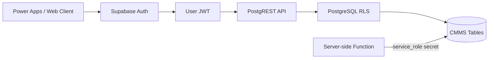

# Week 5 — Supabase Architecture, Authentication และ RLS

## บทนี้จะได้เรียนรู้อะไร

เมื่อจบบทนี้ ผู้เรียนสามารถสร้าง Supabase project สำหรับ Development, อธิบาย Auth/Users/Profiles/Roles, ใช้ JWT และกำหนด Row Level Security (RLS) สำหรับ requester, technician, supervisor และ manager ได้ โดยไม่ส่ง `service_role` key ไปยัง client

## ปัญหาที่ต้องการแก้

การมี database ไม่ได้หมายความว่าข้อมูลปลอดภัย หาก client อ่าน table ได้ทุกแถวหรือผู้ใช้แก้ Status ของคนอื่นได้ ระบบ CMMS จะรั่วข้อมูลและทำลาย workflow Week 5 จึงสร้าง authentication และ authorization เป็นชั้นที่บังคับใช้ใน database

## แนวคิดพื้นฐาน

### Supabase Architecture

Supabase รวม PostgreSQL, Auth, auto-generated REST API, Storage, Realtime และ Functions ไว้ใน project เดียว จุดสำคัญคือ API จาก client ไม่ควรข้าม RLS และ service role ต้องอยู่เฉพาะ server-side



### Authentication และ Authorization

- **Authentication:** พิสูจน์ว่า user เป็นใคร เช่น email/password หรือ SSO
- **Authorization:** ตัดสินว่า user ทำอะไรได้ เช่น technician อ่านเฉพาะงานที่ assign
- **JWT:** token ที่ส่ง claims ของ session ให้ API ตรวจ
- **RLS:** policy ที่ PostgreSQL ใช้กรองแถวทุก query

Authentication อย่างเดียวไม่พอ เพราะ user ที่ login แล้วอาจยังไม่มีสิทธิ์อ่านทุก Site

### Roles และ Keys

| Role/Key | ใช้ที่ใด | สิทธิ์/ความเสี่ยง |
| --- | --- | --- |
| `anon` key | client ที่ยังไม่ login/ใช้ร่วมกับ RLS | key นี้ไม่ใช่สิทธิ์ admin แต่ policy ต้องปลอดภัย |
| `authenticated` | request ที่มี user JWT | RLS ใช้ `auth.uid()` และ claims |
| `service_role` | trusted server/edge function | bypass RLS ห้ามส่งไป client |
| `Project URL` | configuration | ไม่ใช่ secret แต่ต้องแยก environment |

> **Danger:** ห้ามฝัง `service_role` key ใน Power Apps, browser bundle, GitHub repository, Postman collection ที่แชร์ หรือ log

## Step-by-Step

### 1. สร้าง Development Project

สร้าง Supabase project แยกจาก Production ตั้งชื่อที่สื่อว่าเป็น Development และเก็บ Project URL/keys ผ่าน `.env` ที่ไม่ commit

```text
SUPABASE_URL=https://your-project.supabase.co
SUPABASE_ANON_KEY=your-anon-key
# SUPABASE_SERVICE_ROLE_KEY ต้องอยู่ server-side secret store เท่านั้น
```

ใช้ `.env.example` เป็นชื่อ variable เท่านั้น และตรวจ `.gitignore` ก่อน commit

### 2. สร้าง Profiles หลัง Auth User

`auth.users` เป็น identity ที่ Supabase จัดการ ส่วน `public.profiles` เก็บข้อมูล application เช่น display name, department และ role โดยอ้างอิง `auth.users.id`

```sql
create table public.profiles (
  id uuid primary key references auth.users(id) on delete cascade,
  display_name text not null,
  department text,
  role text not null check (role in ('requester','technician','supervisor','manager','admin')),
  created_at timestamptz not null default now()
);

alter table public.profiles enable row level security;
```

### 3. สร้าง Policy สำหรับ Profile

```sql
create policy "users read own profile"
on public.profiles
for select
to authenticated
using (id = auth.uid());

create policy "users update own display name"
on public.profiles
for update
to authenticated
using (id = auth.uid())
with check (id = auth.uid());
```

อย่าให้ user update `role` ผ่าน policy นี้ การเปลี่ยน role ต้องผ่าน admin workflow หรือ server-side function ที่มี audit

### 4. เปิด RLS ให้ทุกตารางที่ client เข้าถึง

```sql
alter table public.sites enable row level security;
alter table public.assets enable row level security;
alter table public.tickets enable row level security;
alter table public.work_orders enable row level security;
alter table public.status_history enable row level security;
```

เปิด RLS แล้วแต่ยังไม่มี policy จะทำให้ query ของ client ไม่คืน row ซึ่งปลอดภัยกว่าการเปิดกว้าง แต่ต้องสร้าง policy ตาม business rule และทดสอบทุก role

### 5. Policy สำหรับ Ticket ของ Requester

```sql
create policy "requester creates own ticket"
on public.tickets
for insert
to authenticated
with check (reporter_id = auth.uid());

create policy "requester reads own tickets"
on public.tickets
for select
to authenticated
using (reporter_id = auth.uid());
```

### 6. Policy สำหรับ Technician และ Supervisor

ตัวอย่างใช้ `work_orders.assignee_id` ให้ technician อ่านงานที่ assign และให้ supervisor อ่านตาม Site โดยควรสร้าง helper function/role mapping ที่ป้องกัน recursion เมื่อระบบซับซ้อน

```sql
create policy "technician reads assigned tickets"
on public.tickets
for select
to authenticated
using (
  reporter_id = auth.uid()
  or exists (
    select 1 from public.work_orders w
    where w.ticket_id = tickets.id and w.assignee_id = auth.uid()
  )
);
```

## ตัวอย่าง Code และ API

### Login ด้วย Supabase Client (ตัวอย่างแนวคิด)

```javascript
const { data, error } = await supabase.auth.signInWithPassword({
  email,
  password
})

if (error) throw new Error('เข้าสู่ระบบไม่สำเร็จ')
// ใช้ data.session.access_token สำหรับ request ที่ผ่าน RLS
```

ห้าม log access token และควรจัดการ refresh/session expiration ตาม client library

### ตรวจ Policy จาก SQL

```sql
select schemaname, tablename, policyname, roles, cmd
from pg_policies
where schemaname = 'public'
order by tablename, policyname;
```

## Use Case จริง: Technician อ่านเฉพาะงานที่ได้รับมอบหมาย

- **Actor:** Technician
- **Preconditions:** login สำเร็จ, profile มี role technician, Work Order มี assignee
- **Trigger:** เปิด My Work
- **Input:** user JWT และ filter status
- **Main Flow:** API รับ JWT → RLS ใช้ `auth.uid()` → คืนเฉพาะ Ticket ที่ถูก assign
- **Alternative Flow:** Supervisor ดูงานของ Site ตาม role mapping
- **Exception Flow:** token หมดอายุ, profile หาย, policy ไม่มี หรือ query ถูกปฏิเสธ
- **Business Rule:** technician แก้ได้เฉพาะ execution fields ที่อยู่ในงานของตน
- **Data Used:** profiles, tickets, work_orders และ status_history
- **Security:** RLS บังคับที่ database; UI visibility ไม่ใช่ security boundary
- **Acceptance Criteria:** technician เปิด Ticket ของคนอื่นด้วย ID ตรง ๆ ไม่ได้
- **KPI:** Unauthorized Access Test Pass Rate และ Assignment Accuracy

## แบบฝึกหัด

### Exercise 1 — RLS Matrix

1. **เป้าหมาย:** สร้างตารางสิทธิ์ของ requester/technician/supervisor/manager
2. **สิ่งที่ต้องเตรียม:** profiles, tickets, work_orders และ test users
3. **ขั้นตอน:** ระบุ table/operation/role/condition แล้วแปลงเป็น policy
4. **Code:** ใช้ policy examples และแก้ให้ตรง Site rule
5. **Expected Result:** user เห็นและแก้ได้ตาม matrix
6. **วิธีตรวจสอบ:** ทดสอบ query ด้วย session ของแต่ละ user
7. **ปัญหา:** policy ไม่คืน row หรือเกิด recursion
8. **วิธีแก้ไข:** ตรวจ `auth.uid()`, relationship และแยก security definer helper อย่างระวัง
9. **Challenge:** ป้องกัน technician เปลี่ยน `assignee_id` หรือ `reporter_id`

### Exercise 2 — Service Role Boundary

สร้าง diagram แสดง client, integration API และ service role secret แล้วเขียนรายการว่า request ใดใช้ anon/authenticated ได้ และ request ใดต้อง server-side

## Mini Project: Supabase Auth และ RLS

### Requirement

สร้าง Supabase Development schema พร้อม Auth, Profiles, Roles และ RLS สำหรับ Ticket/Work Order/Asset

### User Story

ในฐานะผู้ดูแลระบบ ฉันต้องการให้ผู้ใช้แต่ละ role เห็นและแก้ข้อมูลเฉพาะที่รับผิดชอบ เพื่อป้องกันข้อมูลข้าม Site

### Acceptance Criteria

- user ที่ไม่ login อ่านข้อมูล protected ไม่ได้
- requester สร้าง/อ่าน Ticket ของตนเองได้
- technician อ่านงานที่ assign ได้
- supervisor เห็นงานตาม Site และ assign ได้
- role ไม่สามารถแก้โดย client ทั่วไป
- service role ไม่ปรากฏใน source หรือ client request

### Data Model

ใช้ `auth.users`, `profiles`, `sites`, `assets`, `tickets`, `work_orders` และ `status_history`

### Workflow

Sign up/login → profile lookup → JWT request → RLS filter → audit/status update

### Implementation Steps

1. สร้าง Development project
2. รัน core migration
3. สร้าง profiles และ test users
4. เปิด RLS
5. เขียน policies ตาม matrix
6. ทดสอบ select/insert/update/delete แยก role
7. ตรวจ secret scan และ policy catalog

### Test Cases

Unauthenticated Read, Own Ticket Read, Assigned Ticket Read, Cross-user Access, Cross-site Access, Role Update Attempt, Token Expired และ Service Role Boundary

### Expected Output

มี Auth/RLS demonstration, policy SQL, RLS matrix และ test evidence ที่แสดงผลต่างกันของแต่ละ role

### Definition of Done

ทุก table ที่ client เข้าถึงเปิด RLS, policy มี owner/เหตุผล, unauthorized tests ผ่าน และมีวิธี rollback policy ใน Development

## Common Mistakes

- คิดว่า anon key เป็น admin key
- ส่ง service role key ไป Power Apps
- เปิด RLS บาง table แต่ลืม table ที่ join
- ใช้ role ใน UI โดยไม่มี database policy
- ให้ user update role ของตนเอง
- สร้าง policy ที่อ้าง table กลับไปกลับมาจน recursion
- ทดสอบเฉพาะ login แต่ไม่ทดสอบ unauthorized access

## Best Practices

- เริ่มจาก deny-by-default แล้วเพิ่ม policy เท่าที่จำเป็น
- ทำ RLS matrix ก่อนเขียน SQL
- แยก authentication, authorization และ audit ให้ชัด
- ทดสอบ direct REST request ไม่ใช่เฉพาะ UI
- ใช้ environment แยกและ rotate secret เมื่อสงสัยว่ารั่ว
- จำกัดข้อมูลที่ view/API ส่งออกตาม role

## Troubleshooting

| อาการ | สาเหตุที่พบบ่อย | วิธีแก้ |
| --- | --- | --- |
| query ได้ศูนย์ row | RLS เปิดแต่ไม่มี policy/claim ไม่ตรง | ตรวจ policy, role และ `auth.uid()` |
| insert ถูกปฏิเสธ | `with check` ไม่ผ่าน | ตรวจ reporter/assignee กับ user JWT |
| policy recursion | policy query table ที่มี policy กลับมา | ใช้ helper ที่ออกแบบเรื่อง security definer อย่างระวัง |
| service role ใช้ไม่ได้ | ใช้ client-side หรือ key ผิด environment | ย้ายไป server-side secret store |
| token หมดอายุ | session ไม่ refresh | ใช้ auth client session lifecycle และ handle 401 |

## Checklist

- [ ] Development project แยกจาก Production
- [ ] มี `.env.example` และไม่มี secret จริง
- [ ] มี profiles/roles ที่สัมพันธ์กับ auth.users
- [ ] เปิด RLS ทุก protected table
- [ ] มี RLS matrix
- [ ] ทดสอบ requester/technician/supervisor
- [ ] ทดสอบ direct unauthorized request
- [ ] service_role อยู่ server-side เท่านั้น
- [ ] มี audit และ rollback plan สำหรับ policy

## สรุป

Week 5 ทำให้ Supabase เป็น backend ที่มี identity และ data authorization จริง RLS ต้องถูกออกแบบจาก business rule ไม่ใช่เปิด/ปิดเพื่อให้ query ผ่าน และทุกการใช้ service role ต้องมี trusted boundary ชัดเจน

## คำถามทบทวน

1. Authentication และ Authorization ต่างกันอย่างไร
2. RLS ทำงานที่ชั้นใด
3. anon key ใช้ได้เมื่อใด
4. ทำไม service role ห้ามส่งไป client
5. `using` และ `with check` ต่างกันอย่างไร
6. ทำไมเปิด RLS แล้ว query อาจได้ศูนย์ row
7. Profile ควรแยกจาก auth.users เพราะอะไร
8. ทำไม role ไม่ควรแก้จาก client โดยตรง
9. ต้องทดสอบ RLS ด้วย request แบบใด
10. เมื่อใดควรใช้ backend proxy หรือ Edge Function
