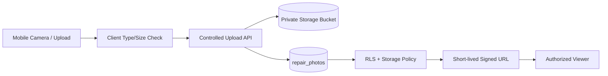

# Week 6 — Supabase Storage และ Image Management

## บทนี้จะได้เรียนรู้อะไร

เมื่อจบบทนี้ ผู้เรียนสามารถออกแบบ Storage Bucket แบบ private/public, ตั้ง object path สำหรับรูป Before/During/After Repair, ตรวจ MIME/size/extension, สร้าง signed URL, เก็บ metadata, จัดการ EXIF และออกแบบ upload/retry สำหรับ mobile ได้อย่างปลอดภัย

## ปัญหาที่ต้องการแก้

รูปซ่อมบำรุงเป็นหลักฐานสำคัญ แต่การเก็บเป็น attachment แบบไม่มีมาตรฐานทำให้ค้นหาและควบคุมสิทธิ์ยาก การเก็บ Base64 ใน database ทำให้ข้อมูลโตเร็ว ส่วน public URL ที่ไม่หมดอายุอาจเปิดเผยรูปหน้างานและพิกัด Week 6 จึงแยก file object ออกจาก metadata และกำหนด policy ชัดเจน

## แนวคิดพื้นฐาน

### Storage Bucket

| Bucket | การใช้งาน | คำแนะนำ |
| --- | --- | --- |
| Public | ไฟล์ที่เผยแพร่ได้จริง | อย่าใช้กับรูปหน้างานโดยอัตโนมัติ |
| Private | รูปซ่อมและหลักฐาน | ใช้ RLS + signed URL |
| Temporary | upload ที่ยังตรวจไม่ผ่าน | ตั้ง lifecycle/retention สั้น |

Bucket เป็น container ส่วน object path เป็นชื่อไฟล์ภายใน bucket; PostgreSQL ควรเก็บ path และ metadata ไม่ใช่ binary file ทั้งก้อน

### Object Path และ File Naming

ใช้ path ที่ predictable แต่ไม่เผยข้อมูลเกินจำเป็น เช่น:

```text
repair-photos/{ticket_id}/{photo_type}/{uuid}.jpg
```

ไม่ใช้ชื่อไฟล์จากผู้ใช้เป็น path ตรง ๆ เพราะอาจมี path traversal, อักขระพิเศษ หรือชื่อที่เผยข้อมูลส่วนบุคคล

### Signed URL

Signed URL เป็นลิงก์ชั่วคราวสำหรับ object private ควรสร้างเมื่อจำเป็น, มีอายุสั้น และไม่บันทึกลง database เป็นค่าถาวร หากลิงก์หลุดให้ลดอายุและสร้างใหม่แทนการเปิด bucket เป็น public

### Metadata และ EXIF

`repair_photos` เก็บ `ticket_id`, `work_order_id`, `photo_type`, `object_path`, `file_name`, `mime_type`, `file_size`, caption, latitude, longitude และผู้ upload ส่วน EXIF อาจมี GPS/device information จึงต้อง strip หรือแจ้ง consent ตามนโยบายองค์กร

## Architecture



### Data Flow

1. Mobile ถ่ายภาพและสร้าง local upload item
2. Client ลดขนาด/ตรวจชนิดเบื้องต้น แต่ server ต้องตรวจซ้ำ
3. Upload API สร้าง object path และอัปโหลดเข้า private bucket
4. API เขียน metadata หลัง upload สำเร็จ หรือ cleanup object เมื่อ metadata fail
5. Viewer ขอ signed URL ตาม Ticket/role ที่ RLS อนุญาต

## Step-by-Step

### 1. สร้าง Private Bucket

สร้าง bucket ชื่อ `repair-photos` และตั้งเป็น private ไม่ควรสร้าง public bucket เพื่อแก้ปัญหา permission ระหว่างพัฒนา

```sql
-- ตัวอย่าง policy สำหรับ storage.objects: ปรับให้ตรงกับ schema/profile จริง
create policy "authorized users read repair photos"
on storage.objects
for select
to authenticated
using (bucket_id = 'repair-photos');
```

ตัวอย่างนี้กว้างเกินไปสำหรับ Production หากต้องจำกัดตาม Ticket ต้องตรวจ object path/relationship กับ `repair_photos` และทำ policy ที่ละเอียดกว่า

### 2. สร้าง Metadata Table

```sql
create table public.repair_photos (
  id uuid primary key default gen_random_uuid(),
  ticket_id uuid not null references public.tickets(id),
  photo_type text not null check (photo_type in ('before','during','after')),
  object_path text not null unique,
  file_name text not null,
  mime_type text not null check (mime_type in ('image/jpeg','image/png','image/webp')),
  file_size bigint not null check (file_size > 0 and file_size <= 10485760),
  caption text,
  latitude numeric(9,6),
  longitude numeric(9,6),
  uploaded_by uuid not null references public.profiles(id),
  uploaded_at timestamptz not null default now()
);

alter table public.repair_photos enable row level security;
```

### 3. Validate File ก่อน Upload

ตรวจอย่างน้อย 4 เรื่อง: MIME type จาก content จริง, extension ที่สอดคล้อง, file size ไม่เกิน 10 MB และ image dimensions ไม่ใหญ่เกิน policy การตรวจ client เป็น UX เท่านั้น ต้องตรวจ server-side ซ้ำ

### 4. Upload และบันทึก Metadata

```javascript
const objectPath = `${ticketId}/${photoType}/${crypto.randomUUID()}.jpg`

const { error: uploadError } = await supabase.storage
  .from('repair-photos')
  .upload(objectPath, file, { contentType: 'image/jpeg', upsert: false })

if (uploadError) throw uploadError

const { error: metadataError } = await supabase
  .from('repair_photos')
  .insert({ ticket_id: ticketId, photo_type: photoType, object_path: objectPath, file_name: file.name, mime_type: file.type, file_size: file.size, uploaded_by: userId })

if (metadataError) {
  await supabase.storage.from('repair-photos').remove([objectPath])
  throw metadataError
}
```

ถ้า metadata insert fail ต้อง cleanup object หรือส่งเข้า orphan cleanup job เพื่อไม่ให้ Storage มีไฟล์ที่ค้นหาไม่ได้

### 5. สร้าง Signed URL

```javascript
const { data, error } = await supabase.storage
  .from('repair-photos')
  .createSignedUrl(objectPath, 300)

if (error) throw error
const temporaryUrl = data.signedUrl
```

อายุ 300 วินาทีเป็นตัวอย่าง ต้องปรับตาม workflow และไม่ส่ง URL ให้ผู้ใช้ที่ไม่มีสิทธิ์ดู Ticket

### 6. Mobile Retry และ Offline Queue

เก็บ local item เป็น `pending → uploading → uploaded → failed`, ใช้ idempotency key/object path เดิมเมื่อ retry และไม่สร้าง object ใหม่ทุกครั้งโดยไม่ตรวจผลครั้งก่อน เมื่อกลับ online ให้ upload ตามลำดับและแสดง progress/failed reason

## ตัวอย่าง Code และ Formula

### Power Apps จำกัดชนิดไฟล์เชิง UX

```powerfx
If(
    !EndsWith(Lower(AttachmentsControl.Attachments[1].Name), ".jpg") &&
    !EndsWith(Lower(AttachmentsControl.Attachments[1].Name), ".png"),
    Notify("รองรับเฉพาะ JPG หรือ PNG", NotificationType.Error),
    Notify("ไฟล์ผ่านการตรวจเบื้องต้น", NotificationType.Success)
)
```

ต้องตรวจ MIME/size ที่ API ด้วย เพราะ client formula ถูกแก้ไขหรือ bypass ได้

### Object Path ที่ไม่ใช้ชื่อไฟล์โดยตรง

```text
{ticket_uuid}/{photo_type}/{random_uuid}.jpg
```

เก็บชื่อเดิมไว้ใน metadata เพื่อแสดงผล แต่ใช้ UUID เป็น object name เพื่อลด collision และป้องกันชื่อที่มีอักขระอันตราย

## Use Case จริง: ตรวจรับงานจาก Before/After Photos

- **Actor:** Technician, Supervisor และ Storage API
- **Preconditions:** Ticket มี Work Order และผู้ใช้ผ่าน authentication
- **Trigger:** Technician upload รูป After Repair
- **Input:** รูป, photo type, caption, location, ticket/work order ID
- **Main Flow:** validate → compress → upload private bucket → insert metadata → Supervisor ขอ signed URL
- **Alternative Flow:** network หลุด → เก็บ local queue และ retry object เดิม
- **Exception Flow:** MIME ไม่ผ่าน, file ใหญ่, quota เต็ม, RLS deny หรือ metadata fail
- **Business Rule:** ปิดงานต้องมี Before และ After ตามประเภทงานที่กำหนด
- **Data Used:** storage.objects และ repair_photos
- **Security:** private bucket, storage policy, RLS, signed URL และ EXIF handling
- **Acceptance Criteria:** รูปถูกผูกกับ Ticket ถูกต้อง, ผู้ไม่มีสิทธิ์เปิด URL ไม่ได้ และมีหลักฐาน upload time/user
- **KPI:** Photo Completeness, Upload Success Rate และ Evidence Review Time

## แบบฝึกหัด

### Exercise 1 — Photo Metadata Design

1. **เป้าหมาย:** ออกแบบ metadata สำหรับรูป 3 ช่วง
2. **สิ่งที่ต้องเตรียม:** Ticket/Work Order schema และ photo requirements
3. **ขั้นตอน:** กำหนด column, type, required, retention และ security owner
4. **Code:** ใช้ migration ตัวอย่างแล้วเพิ่ม work_order_id/caption
5. **Expected Result:** metadata ค้นหาประวัติได้โดยไม่อ่านไฟล์ทั้งหมด
6. **วิธีตรวจสอบ:** insert valid/invalid MIME และ file size
7. **ปัญหา:** path ซ้ำหรือ metadata ไม่มี parent Ticket
8. **วิธีแก้ไข:** UUID path, unique constraint และ foreign key
9. **Challenge:** เพิ่ม thumbnail path และ hash สำหรับ duplicate detection

### Exercise 2 — Retry Upload

จำลอง network failure ระหว่าง upload, ออกแบบ queue state และพิสูจน์ว่า retry ไม่สร้างไฟล์ซ้ำหรือ metadata ซ้ำ

## Mini Project: Secure Repair Photo Workflow

### Requirement

สร้างระบบ upload Before/During/After Repair ที่ใช้ private bucket, metadata table, validation, signed URL และ mobile retry

### User Story

ในฐานะ Technician ฉันต้องการถ่ายรูปหน้างานจากมือถือและ upload ได้แม้ network ไม่เสถียร เพื่อให้ Supervisor ตรวจรับงานจากหลักฐานจริง

### Acceptance Criteria

- รับเฉพาะ image type ที่กำหนดและ size ไม่เกิน limit
- object path ไม่ชนกันและผูก Ticket ถูกต้อง
- metadata และ object ไม่ทิ้ง orphan โดยไม่มี cleanup strategy
- ผู้มีสิทธิ์เท่านั้นที่ขอ signed URL ได้
- retry ไม่สร้าง duplicate object/metadata
- EXIF/location จัดการตาม policy และ consent

### Data Model

`repair_photos` ผูก `ticket_id`, `work_order_id`, `photo_type`, `object_path`, file metadata และ uploaded user

### Workflow

Capture → Local Validate → Compress → Upload → Metadata Insert → Signed URL → Supervisor Review

### Implementation Steps

1. สร้าง private bucket
2. สร้าง metadata table และ RLS
3. สร้าง upload API/action
4. เพิ่ม file validation และ image compression
5. สร้าง signed URL endpoint
6. เพิ่ม local retry queue
7. ทดสอบ permission, invalid file และ orphan cleanup

### Test Cases

Valid Photo, Invalid MIME, File Too Large, Duplicate Upload, Unauthorized Read, Expired Signed URL, Network Failure, Metadata Failure และ EXIF Handling

### Expected Output

มี photo workflow ที่สาธิตได้ครบ 3 photo type พร้อม metadata, signed URL และ retry evidence

### Definition of Done

private bucket ใช้งานได้, policy ผ่าน tests, รูปที่ไม่มี metadata ถูก cleanup/flag, และไม่มี service role key ใน client/source

## Common Mistakes

- เก็บ Base64 ใน PostgreSQL
- ใช้ public bucket กับรูปหน้างานโดยไม่ประเมินความเสี่ยง
- เชื่อ MIME/extension จาก client อย่างเดียว
- ใช้ชื่อไฟล์ผู้ใช้เป็น object path
- ใช้ `upsert: true` จน overwrite หลักฐานเดิม
- สร้าง signed URL อายุยาวเกินไป
- ไม่จัดการ orphan object และ EXIF GPS

## Best Practices

- ใช้ private bucket และ UUID object path
- จำกัด MIME, size, dimensions และ retention
- บันทึก metadata หลัง upload และมี cleanup เมื่อ fail
- ใช้ signed URL อายุสั้น
- strip EXIF หรือแจ้ง consent ตาม policy
- ทำ retry แบบ idempotent และมี queue state
- scan/malware check ตามข้อกำหนด Production

## Troubleshooting

| อาการ | สาเหตุที่พบบ่อย | วิธีแก้ |
| --- | --- | --- |
| upload 403 | storage policy/RLS ไม่ผ่าน | ตรวจ bucket_id, user JWT และ path policy |
| signed URL เปิดไม่ได้ | หมดอายุหรือ path ผิด | สร้าง URL ใหม่และตรวจ object path |
| รูปมีแต่ metadata ไม่มี | insert fail หลัง upload | cleanup object หรือรัน orphan job |
| retry ได้รูปซ้ำ | object path ใหม่ทุกครั้ง | ใช้ idempotency key/path เดิม |
| รูปใหญ่/ช้า | ไม่มี compression/resize | resize ก่อน upload และกำหนด limit |
| location รั่ว | EXIF ยังอยู่ | strip EXIF หรือบังคับ consent/retention |

## Checklist

- [ ] private bucket
- [ ] object path ใช้ UUID และแยก photo type
- [ ] metadata มี FK/unique/check constraints
- [ ] server-side MIME/size validation
- [ ] signed URL อายุสั้น
- [ ] storage policy และ RLS test
- [ ] compression/resize/thumbnail strategy
- [ ] retry/offline queue
- [ ] orphan cleanup และ EXIF policy
- [ ] ไม่มี service role ใน client

## สรุป

Week 6 แยก object storage ออกจาก relational metadata และวาง security boundary สำหรับรูปหน้างาน การ upload ที่ดีต้องคิดทั้ง validation, policy, retry, cleanup, privacy และประสบการณ์ mobile ไม่ใช่เพียงทำให้ไฟล์ถูกเก็บได้

## คำถามทบทวน

1. Public และ Private bucket ต่างกันอย่างไร
2. ทำไม object path ไม่ควรใช้ชื่อไฟล์ตรง ๆ
3. Signed URL มีไว้ทำอะไร
4. ทำไม metadata ต้องอยู่ใน database
5. MIME validation ที่ client อย่างเดียวเพียงพอหรือไม่
6. Orphan object เกิดได้อย่างไร
7. Idempotent retry ช่วยอะไร
8. EXIF อาจมีความเสี่ยงใด
9. ทำไมไม่ควรใช้ upsert กับหลักฐานการซ่อมเสมอ
10. ปิด Work Order ควรตรวจรูป Before/After อย่างไร
