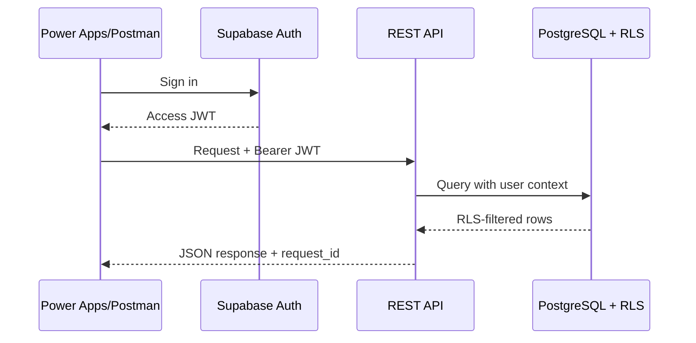

# Week 7 — REST API, JSON, Authentication และ API Testing

## บทนี้จะได้เรียนรู้อะไร

เมื่อจบบทนี้ ผู้เรียนสามารถอธิบาย REST API และ endpoint, ใช้ HTTP methods/status codes/headers, ออกแบบ JSON request/response, ทำ filtering/sorting/pagination, ใช้ JWT/Bearer token และสร้าง test collection สำหรับ Ticket, Work Order, Asset และ Repair Photo ได้

## ปัญหาที่ต้องการแก้

Power Apps, Power Automate, Supabase และ Power BI ต้องแลกเปลี่ยนข้อมูลผ่าน interface ที่ชัดเจน หากส่ง JSON ไม่ตรง schema, ไม่ตรวจ token หรือคืน error ที่เดาไม่ได้ จะทำให้ integration เปราะและแก้ปัญหายาก Week 7 จึงสร้าง API contract และ test cases ที่ตรวจซ้ำได้

## แนวคิดพื้นฐาน

### REST Resource และ Endpoint

REST มองข้อมูลเป็น resource เช่น `/tickets`, `/assets` และ `/work-orders` ไม่ควรสร้าง endpoint ที่ผูกกับปุ่มหน้าจอมากเกินไป Endpoint ต้องมี request/response contract, authentication rule และ error behavior ที่ระบุชัด

### HTTP Methods และ Status Codes

| Method | ใช้ | ตัวอย่าง |
| --- | --- | --- |
| GET | อ่าน | `GET /tickets/{id}` |
| POST | สร้าง | `POST /tickets` |
| PATCH | แก้บาง field | `PATCH /tickets/{id}` |
| PUT | แทน resource ทั้งชุด | ใช้เมื่อ contract รองรับจริง |
| DELETE | ลบ/ขอลบ | CMMS มักใช้ soft delete |

| Code | ความหมาย | ใช้ใน CMMS |
| --- | --- | --- |
| 200/201 | สำเร็จ | อ่าน/สร้างข้อมูล |
| 400 | request ไม่ถูกต้อง | JSON/schema ผิด |
| 401 | ไม่มี identity/Token ไม่ผ่าน | login ใหม่ |
| 403 | มี identity แต่ไม่มีสิทธิ์ | RLS/role deny |
| 404 | ไม่พบ resource | Ticket ID ไม่ถูกต้อง |
| 409 | conflict/duplicate | idempotency หรือ version conflict |
| 422 | validation/business rule fail | priority/status ไม่ถูกต้อง |
| 429 | rate limit | retry แบบ backoff |
| 500 | server failure | monitoring/incident |

### JSON และ API Contract

JSON ควรใช้ชื่อ field สม่ำเสมอ, มี type ชัดเจน, ไม่ส่งข้อมูลเกินจำเป็น และมี error shape เดียวกัน เช่น:

```json
{
  "data": null,
  "error": {
    "code": "VALIDATION_ERROR",
    "message": "priority is not allowed",
    "details": [{"field": "priority", "reason": "invalid_value"}],
    "request_id": "req-demo-001"
  }
}
```

### JWT, Access Token และ Refresh Token

Access token ใช้เรียก API และควรมีอายุจำกัด; refresh token ใช้ขอ session ใหม่ตาม auth provider ห้าม log หรือส่ง token ใน query string และห้ามใช้ service role key แทน user token เพื่อให้ RLS ทำงานตาม user

## Architecture



### Data Flow

1. Client login และรับ access token
2. Client ส่ง `Authorization: Bearer <user_token>` พร้อม anon key ตามการออกแบบ
3. API ตรวจ schema, token, rate limit และ business rules
4. PostgreSQL/RLS ตรวจสิทธิ์แถวอีกชั้น
5. API คืน status code และ JSON shape ที่สม่ำเสมอ
6. Logging เก็บ request ID, duration, status และ error code โดยไม่เก็บ secret/token

## Step-by-Step

### 1. อ่าน Ticket แบบ Filter และ Pagination

```http
GET /rest/v1/tickets?select=id,ticket_number,status,priority&status=eq.in_progress&order=reported_at.desc&limit=20&offset=0
apikey: <anon-key>
Authorization: Bearer <user-access-token>
```

ในข้อมูลขนาดใหญ่ให้ใช้ keyset/cursor pagination และคืน `next_cursor` แทนการเพิ่ม offset ลึก ๆ

### 2. สร้าง Ticket แบบ Idempotent

```http
POST /api/tickets
Authorization: Bearer <user-access-token>
Content-Type: application/json
Idempotency-Key: 5d9e-demo-request-001

{
  "site_id": "00000000-0000-0000-0000-000000000001",
  "asset_id": "00000000-0000-0000-0000-000000000002",
  "description": "MDB temperature alarm",
  "priority": "critical"
}
```

การ retry POST ต้องส่ง key เดิมเพื่อให้ server คืนผลเดิมหรือ conflict ที่อธิบายได้ ไม่สร้าง Ticket ซ้ำ

### 3. อัปเดต Status ด้วย PATCH

```http
PATCH /api/tickets/00000000-0000-0000-0000-000000000003
Authorization: Bearer <user-access-token>
Content-Type: application/json

{"status":"in_progress","note":"Technician started inspection"}
```

Server ต้องตรวจ current status, role และ transition matrix ไม่รับ status ที่ส่งมาจาก client โดยตรงอย่างไม่มี validation

### 4. Error Handling และ Logging

กำหนด error response ให้มี `code`, `message`, `request_id` และ field details ที่ไม่เปิดข้อมูลภายใน ส่วน log ควรมี timestamp, route, user/role แบบไม่ระบุตัวเกินจำเป็น, status, duration และ correlation ID

## ตัวอย่าง Code และ API Test

### JavaScript Request Wrapper

```javascript
async function apiRequest(url, options = {}) {
  const response = await fetch(url, {
    ...options,
    headers: { 'Content-Type': 'application/json', ...options.headers }
  })
  const body = await response.json().catch(() => null)
  if (!response.ok) {
    const code = body?.error?.code ?? 'HTTP_ERROR'
    throw new Error(`${code}: ${body?.error?.message ?? response.status}`)
  }
  return body
}
```

### Postman Test ตัวอย่าง

```javascript
pm.test("status is success", function () {
  pm.expect(pm.response.code).to.be.oneOf([200, 201]);
});

pm.test("response has request id", function () {
  const body = pm.response.json();
  pm.expect(body.request_id || body.error?.request_id).to.be.a("string");
});
```

## Use Case จริง: ทดสอบ API แจ้งซ่อม

- **Actor:** API Tester, Power Apps และ Supabase REST API
- **Preconditions:** มี test user/token และ Development data
- **Trigger:** ต้อง verify release ของ Ticket endpoint
- **Input:** JSON ticket, Bearer token และ idempotency key
- **Main Flow:** login → create → get → patch status → list/filter → verify history
- **Alternative Flow:** 422 จากข้อมูลไม่ครบ, 409 จาก duplicate, 429 จาก rate limit
- **Exception Flow:** token expired, network timeout, server 500
- **Business Rule:** status transition และ RLS ต้องบังคับเหมือน UI
- **Data Used:** tickets, work_orders, assets, repair_photos
- **Security:** token ไม่อยู่ใน URL/log, API key ไม่ใช่ service role, CORS allowlist
- **Acceptance Criteria:** success/error cases ให้ status และ response shape ตรง contract
- **KPI:** API Success Rate, p95 Latency, 4xx/5xx Rate และ Duplicate Prevention Rate

## แบบฝึกหัด

### Exercise 1 — API Contract

1. **เป้าหมาย:** กำหนด endpoint และ JSON schema ของ Ticket
2. **สิ่งที่ต้องเตรียม:** schema ใน `api/schemas/ticket.json`
3. **ขั้นตอน:** ระบุ fields, required, types, status codes และ error shape
4. **Code:** ใช้ request examples ใน `api/examples/tickets.http`
5. **Expected Result:** ผู้ทดสอบสองคนส่ง request เดียวกันแล้วตีความผลเหมือนกัน
6. **วิธีตรวจสอบ:** ทดสอบ valid/invalid JSON และ compare response
7. **ปัญหา:** field naming/type ไม่ตรง client
8. **วิธีแก้ไข:** version contract และเพิ่ม schema validation
9. **Challenge:** เพิ่ม cursor pagination และ ETag/version

### Exercise 2 — API Test Matrix

สร้าง collection ที่มี success, required field, invalid type, unauthorized, forbidden, duplicate, expired token, rate limit และ network failure พร้อม expected result

## Mini Project: CMMS REST API Test Suite

### Requirement

สร้าง API test suite สำหรับ Ticket, Work Order, Asset และ Repair Photo โดยใช้ Postman หรือ Bruno และมี environment variables ที่ไม่มี secret จริง

### User Story

ในฐานะ Integration Engineer ฉันต้องการ test collection ที่รันซ้ำได้ เพื่อยืนยันว่า API, Auth และ RLS ยังทำงานหลังเปลี่ยนแปลงระบบ

### Acceptance Criteria

- มี GET/POST/PATCH examples
- มี schema validation และ consistent error response
- ทดสอบ 401/403/404/409/422/429
- ทดสอบ pagination/filter/sort
- ทดสอบ RLS ด้วย user ต่าง role
- มี request ID และไม่เก็บ token ใน repository

### Data Model

ใช้ Ticket, Work Order, Asset, Repair Photo และ Status History ตาม API schema

### Workflow

Auth setup → Create Ticket → Retrieve/Search → Assign/Update → Upload Metadata → Verify History → Cleanup test data

### Implementation Steps

1. สร้าง environment template
2. เพิ่ม auth/login request
3. เพิ่ม CRUD/read requests
4. เพิ่ม tests และ negative cases
5. เพิ่ม collection variables
6. รันใน Development และเก็บ report
7. ตรวจ secret scan ก่อน commit

### Test Cases

Create Ticket, Required Field, Invalid Type, Duplicate, Unauthorized, Technician Assignment, Status Transition, Photo Metadata, Search, Pagination, Token Expired, Network Failure และ RLS

### Expected Output

Postman/Bruno collection ที่ผู้เรียนคนอื่น import แล้วรันตามลำดับได้ พร้อม test report และ API contract

### Definition of Done

success/negative cases ครบ, environment ไม่มี secret จริง, response contract documented และ test results มี timestamp/version

## Common Mistakes

- ใส่ token ใน URL หรือ commit ใน collection
- ใช้ service role key เพื่อให้ test ผ่าน
- Retry POST โดยไม่มี idempotency key
- คืนข้อความ error จาก database ตรง ๆ
- ไม่มี timeout หรือ rate-limit handling
- ใช้ offset pagination กับข้อมูลใหญ่มากโดยไม่วัด performance
- ทดสอบเฉพาะ 200 ไม่ทดสอบ 401/403/409/422

## Best Practices

- ใช้ OpenAPI/JSON schema เป็น contract
- ใช้ Bearer user token และให้ RLS ทำงาน
- มี request/correlation ID ทุก request
- แยก environment variables จาก collection
- ตรวจ input ที่ API และ database
- จำกัด CORS และ rate limit
- ทำ contract/integration tests ใน CI โดยใช้ test project

## Troubleshooting

| อาการ | สาเหตุที่พบบ่อย | วิธีแก้ |
| --- | --- | --- |
| 401 | token หมดอายุ/ส่ง header ผิด | login ใหม่และตรวจ Bearer format |
| 403 | RLS/role ไม่อนุญาต | ตรวจ policy และ user context |
| 409 | idempotency key/unique ซ้ำ | ใช้ key เดิมเพื่ออ่านผลเดิมหรือสร้าง key ใหม่เมื่อเป็น request ใหม่ |
| 422 | schema/business rule fail | อ่าน field details และแก้ payload |
| 429 | เรียกถี่เกิน | backoff และเคารพ Retry-After |
| 5xx | server/dependency failure | ใช้ request_id หา log และ retry อย่างจำกัด |

## Checklist

- [ ] API resource/endpoint ชัดเจน
- [ ] HTTP method/status code documented
- [ ] JSON schema และ error shape
- [ ] Bearer JWT และ RLS test
- [ ] Pagination/filter/sort
- [ ] Idempotency สำหรับ POST
- [ ] CORS/rate limit/timeout
- [ ] Postman/Bruno collection
- [ ] ไม่มี token/service role ใน source
- [ ] มี request ID และ logging guideline

## สรุป

Week 7 ทำให้ integration ของ CMMS มี contract และวิธีทดสอบที่ทำซ้ำได้ API ที่ดีต้องปกป้องข้อมูล, บอก error ที่แก้ได้, รองรับ retry อย่างปลอดภัย และให้ client ทำงานกับ response ได้โดยไม่เดา

## คำถามทบทวน

1. REST resource ใน CMMS มีอะไรบ้าง
2. POST และ PATCH ต่างกันอย่างไร
3. 401 และ 403 ต่างกันอย่างไร
4. 409 ใช้ในกรณีใด
5. Idempotency key ช่วยอะไร
6. ทำไมไม่ส่ง token ใน URL
7. RLS เกี่ยวข้องกับ API อย่างไร
8. Rate limit และ Retry-After ใช้ทำอะไร
9. Error response ที่ดีควรมี field ใด
10. API test suite ควรมี negative cases ใดบ้าง
