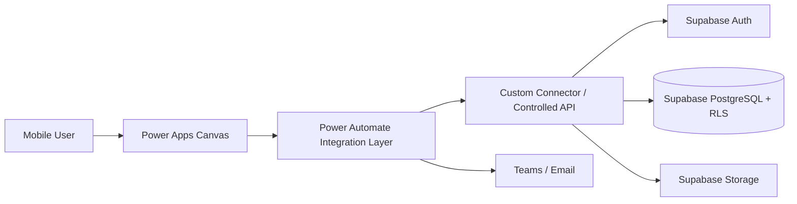

# Week 8 — Integrate Power Apps with Supabase

## บทนี้จะได้เรียนรู้อะไร

เมื่อจบบทนี้ ผู้เรียนสามารถเลือกวิธีเชื่อม Power Apps กับ Supabase, ออกแบบ Custom Connector และ Power Automate integration layer, map JSON, จัดการ authentication/API key, pagination/delegation, retry/timeout และแยก Development/Test/Production connection ได้

## ปัญหาที่ต้องการแก้

Power Apps ไม่ควรเชื่อม Supabase ด้วย service role key โดยตรง การเรียก API ที่ไม่มี contract หรือเก็บ secret ในสูตรจะเสี่ยงข้อมูลรั่วและทำให้เปลี่ยน environment ยาก Week 8 จึงกำหนด boundary ระหว่าง Canvas App, Power Automate/controlled API และ Supabase

## แนวคิดพื้นฐาน

### Integration Options

| วิธี | เหมาะกับ | ข้อจำกัด |
| --- | --- | --- |
| Custom Connector ตรง API | contract เสถียรและมี auth ที่ปลอดภัย | ต้องดูแล connector/connection |
| Power Automate เป็น layer | ทีม Microsoft 365, approval/notification | latency และ run limits |
| Azure/Edge Function | logic/server secret ซับซ้อน | ต้องดูแล runtime/deployment |
| Hybrid SharePoint + Supabase | migration ค่อยเป็นค่อยไป | ต้อง sync/conflict ให้ชัด |

### Key Security Rules

1. `service_role` key ห้ามฝังใน Power Apps หรือ client
2. ใช้ user access token/RLS เมื่อ client ต้องอ่านข้อมูลตาม user
3. ถ้าต้องใช้ privileged operation ให้เรียก controlled API/Function ที่เก็บ secret server-side
4. API key และ connection reference ต้องอยู่ใน environment/solution configuration
5. Validation ต้องทำที่ API/database ไม่พึ่ง Power Apps UI

### Delegation และ Pagination

Delegation คือการผลัก filter/query ไปยัง data source แทนการโหลดข้อมูลทั้งหมดมาให้ client หาก connector delegate ไม่ได้ ผลลัพธ์อาจถูกจำกัดตาม app row limit และไม่ครบ Work Order จริง จึงใช้ server-side filter + pagination เป็นหลัก

## Architecture



### Data Flow

1. Power Apps ส่ง input ที่ผ่าน client validation และ correlation ID
2. Power Automate ตรวจ schema, environment และ retry rule
3. Connector/API ใช้ user context หรือ server-side secret ตาม operation
4. Supabase Auth/RLS ตรวจ identity และ row access
5. Flow map response กลับเป็น Power Apps-friendly shape
6. Error path คืน code/message ที่ผู้ใช้เข้าใจได้และเก็บรายละเอียดใน monitoring

## Step-by-Step

### 1. กำหนด API Contract ก่อนสร้าง Connector

ใช้ OpenAPI ใน `power-apps/custom-connector/openapi.yaml` กำหนด `CreateTicket`, request fields, response, 400/401/403/409 และ timeout behavior อย่าเริ่มจากการกดสร้าง connector โดยไม่มี contract เพราะแก้ schema ภายหลังจะกระทบทุก app

### 2. ตั้งค่า Environment และ Connection Reference

แยก Power Platform Solutions เป็น Dev/Test/Prod และใช้ environment variables เช่น `ApiBaseUrl`, `SupabaseProjectUrl`, `ApiAudience` ไม่ฝัง URL/key ในสูตร ให้ connection reference ชี้ connector/auth ของ environment นั้น

### 3. สร้าง Flow เป็น Integration Layer

Flow `Cmms_CreateTicket`:

1. Trigger จาก Power Apps
2. Validate required fields/type/length
3. สร้าง correlation/idempotency key
4. เรียก Custom Connector/API
5. Parse JSON ตาม schema
6. คืน `ticket_number`, `status`, `request_id`
7. แจ้ง Teams เฉพาะหลัง transaction สำเร็จ
8. จัดการ 4xx/5xx แยกกัน

### 4. Map JSON กลับ Power Apps

```json
{
  "data": {
    "ticket_id": "00000000-0000-0000-0000-000000000001",
    "ticket_number": "CMMS-20260719-0001",
    "status": "submitted"
  },
  "request_id": "req-001"
}
```

Power Automate Parse JSON ควรกำหนด required/nullable ให้ตรงกับ API และสร้าง output ที่เป็นชื่อ field คงที่ ไม่ส่ง raw database row กลับไปทั้งหมด

### 5. เรียก Flow จาก Power Apps

```powerfx
Set(varRequestId, GUID());
Set(varResponse, Cmms_CreateTicket.Run(
    JSON({
        site_id: ddSite.Selected.id,
        asset_id: ddAsset.Selected.id,
        description: txtDescription.Text,
        priority: ddPriority.Selected.Value,
        client_request_id: Text(varRequestId)
    }, JSONFormat.Compact)
));

If(IsBlank(varResponse.ticket_number), Notify("สร้าง Ticket ไม่สำเร็จ", NotificationType.Error), Notify("สร้าง " & varResponse.ticket_number & " สำเร็จ", NotificationType.Success))
```

ให้ Flow คืน error response ที่ mapping ได้ และอย่ารับ service role key จาก formula

### 6. Pagination และ Delegation

ออกแบบ Flow/API ให้รับ `page_size`, `cursor`, `site_id`, `status` แล้วให้ Power Apps โหลดทีละหน้าแทน `ClearCollect` ข้อมูลทั้งหมด หากต้องค้นหาแบบ server-side ให้ query API ไม่ใช้ `Filter` บน collection ขนาดใหญ่

### 7. Retry, Timeout และ Conflict

- Retry 429/บาง 5xx ด้วย exponential backoff
- ไม่ retry 400/401/403/422 โดยอัตโนมัติ
- ตั้ง timeout ให้เหมาะกับ mobile และ Flow run limit
- ใช้ `Idempotency-Key` กับ create
- ใช้ `updated_at/version` ตรวจ optimistic concurrency
- เมื่อ conflict ให้แจ้งผู้ใช้และให้เลือกข้อมูล ไม่ overwrite เงียบ ๆ

## ตัวอย่าง Code และ Formula

### Error Branch ใน Power Apps

```powerfx
IfError(
    Set(varResponse, Cmms_GetTickets.Run(ddStatus.Selected.Value, varNextCursor));
    ClearCollect(colTickets, varResponse.data),
    Notify("เชื่อมต่อระบบไม่ได้ กรุณาลองใหม่", NotificationType.Error)
)
```

### Power Automate Retry Policy แนวคิด

```text
429: retry 3 ครั้ง, exponential backoff, เคารพ Retry-After
502/503/504: retry 2 ครั้ง แล้วส่ง monitoring alert
400/401/403/422: ไม่ retry, คืน error ที่แก้ไขได้
```

### SharePoint-to-Supabase Migration Mapping

| SharePoint | Supabase | กฎ |
| --- | --- | --- |
| Title | ticket_number | trim/unique/reconcile |
| Person Reporter | reporter_id | map email ไป auth/profile |
| Choice Priority | priority | normalize lowercase |
| Lookup Asset | asset_id | mapด้วย asset_code |
| Attachment | storage object | upload แล้วเก็บ object_path |
| Modified | updated_at | ใช้ conflict detection |

## Use Case จริง: Power Apps อ่านและสร้าง Ticket ใน Supabase

- **Actor:** Requester, Power Apps, Power Automate และ Supabase
- **Preconditions:** Solution มี connector/connection reference และ user authenticated
- **Trigger:** ผู้ใช้กด Submit จากมือถือ
- **Input:** Ticket payload, user identity, correlation/idempotency key
- **Main Flow:** validate → Flow → API → Auth/RLS → database transaction → response mapping
- **Alternative Flow:** อ่านข้อมูลด้วย cursor pagination และ cache เฉพาะ lookup master
- **Exception Flow:** timeout, 401, 403, 409, 429, offline
- **Business Rule:** requester สร้าง Ticket ของตนเอง; service role ใช้เฉพาะ trusted server
- **Data Used:** ticket, asset, site, profile และ status history
- **Security:** connection reference/secret management/RLS/CORS และ no secret in client
- **Acceptance Criteria:** create/read ได้ตาม role, duplicate ไม่เกิด, error แสดงได้
- **KPI:** Integration Success Rate, Retry Rate, API Latency และ Sync Conflict Rate

## แบบฝึกหัด

### Exercise 1 — Connector Contract

1. **เป้าหมาย:** สร้าง OpenAPI/Custom Connector ที่มี CreateTicket/GetTickets
2. **สิ่งที่ต้องเตรียม:** `openapi.yaml`, API test suite และ environment variables
3. **ขั้นตอน:** กำหนด request/response/auth/error, import connector และทดสอบใน Dev
4. **Code:** ใช้ JSON contract ในบทนี้
5. **Expected Result:** Power Apps เรียก action ได้และได้รับ typed response
6. **วิธีตรวจสอบ:** ทดสอบ success/401/403/422/409
7. **ปัญหา:** dynamic response หรือ schema ไม่ตรง
8. **วิธีแก้ไข:** ทำ response contract ให้ stable และ version operation
9. **Challenge:** เพิ่ม cursor pagination และ typed error output

### Exercise 2 — Delegation และ Retry

สร้างหน้าค้นหา Ticket ที่ส่ง filter/site/status ไป API และสร้าง Flow retry เฉพาะ 429/5xx พร้อมบันทึก correlation ID

## Mini Project: Power Apps–Supabase Integration

### Requirement

ให้ Power Apps อ่านและเขียน Ticket/Work Order ผ่าน Power Automate + Custom Connector หรือ controlled API โดยไม่เปิด service role key ให้ client

### User Story

ในฐานะผู้ใช้งานภาคสนาม ฉันต้องการแจ้งซ่อมและดูสถานะจาก Power Apps ขณะที่ระบบเก็บข้อมูลหลักใน Supabase ตามสิทธิ์ของฉัน

### Acceptance Criteria

- Power Apps สร้าง Ticket สำเร็จผ่าน integration layer
- response มี Ticket Number, status และ request ID
- requester/technician เห็นข้อมูลตาม RLS
- pagination/filter ทำงานที่ server-side
- 401/403/422/429 แสดงผลเหมาะสม
- duplicate submission ไม่สร้าง Ticket ซ้ำ
- Dev/Test/Prod ใช้ connection reference คนละชุด

### Data Model

ใช้ `profiles`, `sites`, `assets`, `tickets`, `work_orders`, `status_history` และ API DTO ที่ไม่เปิด raw table ทั้งหมด

### Workflow

Power Apps → Flow → Connector/API → Auth/RLS → Supabase → mapped response → UI/notification

### Implementation Steps

1. กำหนด API contract
2. สร้าง environment variables
3. สร้าง Solution/connection references
4. สร้าง connector/Flow actions
5. map JSON response
6. เพิ่ม pagination/retry/timeout
7. ทดสอบ role/error/conflict
8. จัดทำ deployment notes

### Test Cases

Create Ticket, Get Tickets, Pagination, Delegation, Invalid Payload, Unauthorized, RLS, Duplicate, Retry 429, Timeout, Conflict และ environment switch

### Expected Output

Power Apps prototype ที่อ่าน/เขียน Supabase ได้ผ่าน boundary ที่ปลอดภัย พร้อม connector/Flow documentation และ test evidence

### Definition of Done

ไม่มี service role ใน client, integration errors ตรวจสอบได้, duplicate/conflict มี behavior ชัด และเปลี่ยน environment ได้โดยไม่แก้สูตรหลัก

## Common Mistakes

- เรียก Supabase service role จาก Canvas App
- ใส่ URL/key ใน Power Fx
- โหลด Ticket ทั้ง table เข้า collection
- Retry ทุก error รวม validation/permission
- ไม่ใช้ connection reference
- Map JSON แบบพึ่งตำแหน่งหรือ raw body ที่เปลี่ยนได้
- Ignore timeout/offline/conflict
- Migration จาก SharePoint โดยไม่ reconcile IDs/attachments

## Best Practices

- API contract ก่อน connector
- ใช้ Power Automate เป็น orchestration แต่ให้ backend enforce rules
- แยก DTO กับ database row
- ใช้ server-side filter/pagination
- ใช้ correlation/idempotency/version
- เก็บ secret ใน managed environment/secret store
- ทดสอบ Dev/Test ก่อน deploy Production

## Troubleshooting

| อาการ | สาเหตุที่พบบ่อย | วิธีแก้ |
| --- | --- | --- |
| Connector 401 | token/connection reference ผิด | ตรวจ auth scheme และ environment connection |
| Flow timeout | payload ใหญ่/รอ action นาน | ลด payload, async job หรือเพิ่ม timeout ตาม policy |
| Power Apps ได้ข้อมูลไม่ครบ | non-delegation/ไม่มี pagination | ส่ง filter/cursor ไป server |
| 403 จาก Supabase | RLS ไม่ตรง user/role | ทดสอบ direct API ด้วย user JWT |
| duplicate Ticket | ไม่มี idempotency | ส่ง client request ID เดิมทุก retry |
| Deploy แล้วเรียก Dev | hard-coded URL/connection | ใช้ environment variable/reference |

## Checklist

- [ ] API contract/OpenAPI
- [ ] Custom Connector หรือ Flow integration
- [ ] Auth และ RLS boundary
- [ ] ไม่ใช้ service role ใน client
- [ ] Environment variables/references
- [ ] JSON mapping
- [ ] Delegation/pagination
- [ ] Retry/timeout/conflict
- [ ] SharePoint migration mapping
- [ ] Dev/Test/Prod deployment notes

## สรุป

Week 8 เชื่อมโลก Power Platform กับ Supabase โดยวาง integration boundary ที่ปลอดภัย Power Apps ทำหน้าที่ UI, Flow/Connector ทำหน้าที่ orchestration และ Supabase/Auth/RLS เป็น source of truth ของข้อมูลและสิทธิ์

## คำถามทบทวน

1. ทำไม Power Apps ไม่ควรใช้ service role key
2. Custom Connector ต่างจาก Power Automate อย่างไร
3. Connection reference ช่วยอะไร
4. Delegation warning เกิดจากอะไร
5. ทำไมต้อง server-side pagination
6. Error ใดควร retry
7. Idempotency และ version ต่างกันอย่างไร
8. DTO ต่างจาก raw database row อย่างไร
9. Migration attachment ต้องคำนึงถึงอะไร
10. ทำไมต้องแยก Dev/Test/Prod connection
