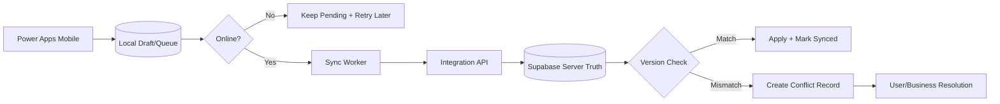

# Week 9 — Synchronization, Offline และ Conflict Handling

## บทนี้จะได้เรียนรู้อะไร

เมื่อจบบทนี้ ผู้เรียนสามารถออกแบบ local draft/offline queue, sync กับ Supabase เมื่อ online, ใช้ idempotency/version, ตรวจ conflict, ทำ reconciliation ระหว่าง SharePoint กับ Supabase และกำหนดกฎว่า server หรือ user เป็นผู้ชนะในแต่ละ field ได้

## ปัญหาที่ต้องการแก้

งานภาคสนามอาจอยู่ในจุดที่สัญญาณอ่อน ผู้ใช้ต้องบันทึกข้อมูลและรูปไว้ก่อน หากระบบส่งข้อมูลซ้ำเมื่อกลับ online หรือเขียนทับการแก้ไขของ Supervisor จะทำให้ Ticket/Work Order ผิดและเสียหลักฐาน Week 9 จึงออกแบบ offline-first แบบมีขอบเขต ไม่สัญญาว่าทุกข้อมูลจะ sync ได้โดยไม่มี conflict

## แนวคิดพื้นฐาน

### Local Draft, Pending Queue และ Server Truth

| State | ความหมาย | การทำงาน |
| --- | --- | --- |
| Draft | ผู้ใช้ยังไม่ส่ง | แก้ได้ในเครื่อง |
| Pending | รอ sync | มี idempotency key และ retry count |
| Uploading | กำลังส่ง | lock ไม่ให้กดซ้ำ |
| Synced | server ยืนยันแล้ว | เก็บ server ID/version |
| Failed | ส่งไม่สำเร็จ | แสดงเหตุผลและ retry/manual resolve |
| Conflict | server เปลี่ยนก่อน | ห้าม overwrite เงียบ ๆ |

Server truth คือข้อมูลที่ backend ยืนยันแล้ว แต่ไม่ได้หมายความว่า server ชนะทุก field ต้องกำหนด merge policy ตาม business rule เช่น Status ที่ Supervisor เปลี่ยนชนะ local status ส่วน caption รูปอาจให้ผู้ใช้เลือกได้

### Idempotency และ Version

Idempotency ป้องกัน request เดิมสร้างผลลัพธ์ซ้ำ ส่วน version/`updated_at` ตรวจว่าข้อมูลที่ผู้ใช้แก้ยังเป็น version ล่าสุดหรือไม่ ทั้งสองอย่างแก้คนละปัญหาและควรใช้ร่วมกัน

### Offline Scope

กำหนดให้ชัดว่า offline ทำอะไรได้: สร้าง Draft Ticket, ถ่ายรูป, อ่าน Asset ที่ cache แล้ว และเพิ่มผลตรวจสอบเบื้องต้น ส่วนการ assign, close, approval และข้อมูลที่ sensitive อาจต้อง online เท่านั้น

## Architecture



### Data Flow

1. App สร้าง local record พร้อม `client_request_id`, `local_version` และ `created_at`
2. Sync worker เรียง queue ตาม dependency เช่น Ticket ก่อน Photo metadata
3. API ตรวจ idempotency และ `expected_version`
4. Server บันทึกหรือคืน conflict response
5. App mark synced หรือแสดง conflict ให้ผู้ใช้ตัดสินใจ
6. Reconciliation job ตรวจ local/server counts และ orphan/failed records

## Step-by-Step

### 1. ออกแบบ Local Queue

```json
{
  "local_id": "local-001",
  "operation": "create_ticket",
  "client_request_id": "req-001",
  "payload": {"description": "Pump vibration", "priority": "urgent"},
  "state": "pending",
  "retry_count": 0,
  "created_at": "2026-07-19T02:00:00Z"
}
```

ไม่เก็บ access token ใน queue และควร encrypt local data ตามความเสี่ยงของอุปกรณ์/องค์กร

### 2. Sync ด้วย Idempotency

```http
POST /api/tickets
Authorization: Bearer <user-access-token>
Idempotency-Key: req-001
If-None-Match: "ticket-version-0"
Content-Type: application/json

{"description":"Pump vibration","priority":"urgent"}
```

ถ้า server เคยรับ `req-001` แล้ว ให้คืนผลเดิมหรือ `409` พร้อม resource ที่สร้างแล้ว ไม่สร้าง Ticket ที่สอง

### 3. Optimistic Concurrency

```http
PATCH /api/work-orders/wo-001
If-Match: "version-7"
Authorization: Bearer <user-access-token>
Content-Type: application/json

{"repair_result":"Replaced bearing"}
```

ถ้า server version เป็น 8 แล้ว ให้คืน `409 VERSION_CONFLICT` พร้อม current representation ที่ตัดข้อมูลเกินสิทธิ์ออก

### 4. Conflict Resolution Matrix

| Field | Conflict Winner | เหตุผล |
| --- | --- | --- |
| Status | Supervisor/server | ป้องกันปิดงานทับ workflow |
| Assignee | Supervisor/server | เป็นการจัดกำลังคน |
| Repair Result | latest reviewed value | ต้อง review ก่อน close |
| Caption | User choice/last edit | ความเสี่ยงต่ำกว่า status |
| GPS | latest accepted capture | ตรวจ timestamp/accuracy |
| Photo object | keep both/versioned | ห้ามลบหลักฐานอัตโนมัติ |

### 5. Offline Photo Queue

เก็บ local compressed image พร้อม hash, photo type, ticket local ID และ upload state; เมื่อ Ticket ได้ server ID แล้วจึง resolve path ของรูปและ upload metadata ตาม dependency ไม่ควรผูก object path กับ local ID ที่จะเปลี่ยนโดยไม่มี mapping

### 6. SharePoint-to-Supabase Reconciliation

ทำ migration แบบ incremental: export snapshot → map keys → load parent/master → load Ticket → load attachment → compare counts/checksums → flag conflict → sign-off ก่อน freeze source เดิม

## ตัวอย่าง Code และ Formula

### Power Apps Offline Draft

```powerfx
SaveData(
    Collect(
        colPendingTickets,
        {
            local_id: Text(GUID()),
            client_request_id: Text(GUID()),
            description: txtDescription.Text,
            priority: ddPriority.Selected.Value,
            sync_state: "pending",
            retry_count: 0
        }
    ),
    "cmms_pending_tickets"
)
```

ห้ามถือว่า `SaveData` เป็น database ถาวร ต้องมี retention, device security และวิธีล้างข้อมูลเมื่อ logout/หมดอายุ

### ตรวจ Online Status

```powerfx
If(Connection.Connected, Notify("พร้อม sync", NotificationType.Success), Notify("ออฟไลน์: บันทึกเป็น Draft", NotificationType.Warning))
```

### Sync Loop แนวคิด

```text
โหลด pending ที่ยังไม่หมดอายุ
เรียงตาม created_at/dependency
ส่งด้วย client_request_id + expected_version
2xx → mark synced
409 → mark conflict และหยุด row นั้น
429/5xx/network → retry with backoff
4xx validation → mark failed และให้แก้ข้อมูล
```

## Use Case จริง: Technician บันทึกผลในพื้นที่สัญญาณอ่อน

- **Actor:** Technician, Power Apps Mobile, Sync API
- **Preconditions:** มี Asset cache และ user login ก่อนออกหน้างาน
- **Trigger:** เปิดงานและพบสัญญาณขาดหาย
- **Input:** ผลตรวจ, รูป, เวลา, location และ local request ID
- **Main Flow:** บันทึก local → กลับ online → sync Ticket/Photo → server ตอบ version → mark synced
- **Alternative Flow:** รูป upload ไม่ผ่าน → retry เฉพาะ photo โดยไม่สร้าง Ticket ใหม่
- **Exception Flow:** Ticket ถูก Supervisor เปลี่ยน status, token expired, device storage เต็ม
- **Business Rule:** ห้าม offline ปิดงาน Critical หากไม่มีการตรวจรับ server-side
- **Data Used:** local queue, tickets, work_orders, repair_photos, versions
- **Security:** encrypt/local retention, no token in queue, server RLS และ signed upload
- **Acceptance Criteria:** ไม่มี duplicate, conflict แสดงชัด, หลักฐานไม่หาย
- **KPI:** Sync Success Rate, Conflict Rate, Queue Age และ Offline Completion Rate

## แบบฝึกหัด

### Exercise 1 — Offline Queue State Machine

1. **เป้าหมาย:** ออกแบบ state และ transition ของ local queue
2. **สิ่งที่ต้องเตรียม:** Power Apps prototype และ API idempotency contract
3. **ขั้นตอน:** กำหนด state, retry limit, expiry, dependency และ UI behavior
4. **Code:** ใช้ local record และ sync loop ในบทนี้
5. **Expected Result:** ผู้ใช้รู้ว่างานใด pending/failed/conflict
6. **วิธีตรวจสอบ:** ตัด network ระหว่าง create/upload
7. **ปัญหา:** retry ซ้ำหรือ queue ค้าง
8. **วิธีแก้ไข:** max retry, backoff, dead-letter/failed state และ manual retry
9. **Challenge:** เพิ่ม background sync เมื่อ app กลับ foreground

### Exercise 2 — Conflict Resolution

สร้าง scenario ที่ Technician แก้ `repair_result` ขณะ Supervisor เปลี่ยน status แล้วกำหนด merge policy, UI resolution และ audit record

## Mini Project: Offline Field Work and Synchronization

### Requirement

สร้าง workflow ที่ Technician สร้าง Draft Ticket, บันทึกผลและรูป offline แล้ว sync กลับ Supabase อย่างปลอดภัยเมื่อ online

### User Story

ในฐานะ Technician ภาคสนาม ฉันต้องการทำงานต่อได้เมื่อ network หลุด และต้องเห็นชัดว่ารายการใด sync สำเร็จหรือเกิด conflict

### Acceptance Criteria

- Draft เก็บ local พร้อม request ID
- Sync กลับมาแล้วไม่สร้าง duplicate
- รูป upload หลัง parent Ticket มี server ID
- Conflict status/assignment ไม่ถูก overwrite เงียบ ๆ
- Failed validation มีคำอธิบายและแก้ retry ได้
- Token/secret ไม่ถูกเก็บใน local queue

### Data Model

Local queue: `local_id`, operation, payload, client_request_id, state, retry_count, version; Server: Ticket/Work Order/Photo metadata พร้อม `updated_at/version`

### Workflow

Draft → Pending → Uploading → Synced หรือ Failed/Conflict → Manual Resolve → Retry

### Implementation Steps

1. กำหนด offline scope
2. สร้าง local queue state
3. เพิ่ม idempotency/version API contract
4. สร้าง sync worker
5. เพิ่ม photo dependency mapping
6. เพิ่ม conflict UI/audit
7. จำลอง offline/reconnect/duplicate/version conflict
8. ทำ reconciliation report

### Test Cases

Offline Create, Reconnect Sync, Duplicate Retry, Token Expired, Network Failure, File Queue, Parent-Child Dependency, Version Conflict, Manual Resolve และ Queue Expiry

### Expected Output

มี mobile workflow, sync state diagram, conflict matrix, test evidence และ reconciliation result

### Definition of Done

ระบบไม่สร้าง duplicate, conflict มีทางแก้, failed queue ไม่หาย, sensitive data มี retention และ server เป็น source of truth ที่ตรวจสอบได้

## Common Mistakes

- คิดว่า offline data จะปลอดภัยโดยอัตโนมัติ
- retry POST โดยสร้าง idempotency key ใหม่ทุกครั้ง
- overwrite server record โดยไม่ตรวจ version
- sync child photo ก่อน parent Ticket
- เก็บ token/password ใน local storage
- ไม่มี max retry/queue expiry
- ให้ offline user ปิดงาน Critical โดยไม่ตรวจ server

## Best Practices

- กำหนด offline scope อย่างซื่อสัตย์
- ใช้ idempotency + optimistic concurrency
- แยก pending/failed/conflict อย่างชัดเจน
- encrypt/limit local data และล้างเมื่อ logout ตาม policy
- sync dependency ตามลำดับ
- เก็บ audit ของ resolution
- ทดสอบ device storage, clock skew และ reconnect ซ้ำ ๆ

## Troubleshooting

| อาการ | สาเหตุที่พบบ่อย | วิธีแก้ |
| --- | --- | --- |
| Ticket ซ้ำ | request ID เปลี่ยนตอน retry | คง idempotency key เดิมและใช้ unique constraint |
| รูปผูก Ticket ไม่ได้ | upload ก่อนมี server ID | sync parent ก่อน child และทำ local-to-server mapping |
| conflict หาย | overwrite โดยไม่มี If-Match | ใช้ expected version และเก็บ conflict record |
| queue ค้าง | ไม่มี retry/expiry policy | เพิ่ม backoff, max retry และ failed state |
| ข้อมูล local รั่ว | เก็บ token/PII มากเกิน | encrypt, minimize, clear และใช้ device policy |

## Checklist

- [ ] กำหนด offline scope
- [ ] Local queue state machine
- [ ] Idempotency key
- [ ] Version/conflict policy
- [ ] Parent-child sync order
- [ ] Retry/backoff/max retry
- [ ] Offline photo strategy
- [ ] Local retention/encryption
- [ ] Reconciliation report
- [ ] Audit/manual resolution

## สรุป

Week 9 ทำให้ CMMS รองรับงานภาคสนามอย่างมีความรับผิดชอบ Offline-first ไม่ใช่การซ่อนความล้มเหลว แต่คือการบอก state ให้ชัด, sync อย่าง idempotent, ตรวจ version และให้ผู้ใช้แก้ conflict ที่สำคัญได้

## คำถามทบทวน

1. Local draft ต่างจาก server truth อย่างไร
2. Idempotency และ version check แก้ปัญหาใด
3. ทำไมต้อง sync parent ก่อน photo
4. Conflict field ใดควรให้ Supervisor ชนะ
5. ทำไมไม่ควรเก็บ token ใน queue
6. Retry แบบใดสร้าง duplicate
7. Queue expiry มีไว้ทำอะไร
8. Offline scope ควรตัดสินจากอะไร
9. Reconciliation report ตรวจอะไร
10. ทำไม Critical closure ควรต้อง online/server validation
