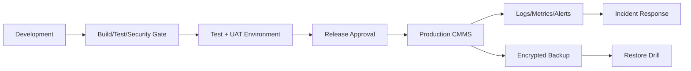

# Week 10 — Production-Ready CMMS Architecture และ Operations

## บทนี้จะได้เรียนรู้อะไร

เมื่อจบบทนี้ ผู้เรียนสามารถแยก Development/Test/Production, จัดการ configuration และ secrets, ออกแบบ RBAC/RLS/audit log, วาง backup/restore/disaster recovery, กำหนด retention, monitoring, performance, deployment checklist และ rollback plan สำหรับ CMMS ได้

## ปัญหาที่ต้องการแก้

ระบบที่ทำงานได้ในเครื่องผู้พัฒนาอาจล้มเหลวเมื่อมีผู้ใช้จริง ข้อมูลจริง และการเปลี่ยนแปลงต่อเนื่อง Production-ready ไม่ได้หมายถึงไม่มี error แต่หมายถึงตรวจพบเร็ว กู้คืนได้ รู้ว่าใครรับผิดชอบ และไม่ทำให้การ deploy ครั้งหนึ่งทำลายข้อมูลหรือสิทธิ์

## แนวคิดพื้นฐาน

### Environment Separation

| Environment | จุดประสงค์ | ข้อมูล | สิทธิ์ |
| --- | --- | --- | --- |
| Development | พัฒนา/ทดลอง | synthetic/demo | developer จำกัด |
| Test/UAT | ทดสอบ integration/ธุรกิจ | masked/synthetic | tester/business owner |
| Production | ใช้งานจริง | real governed data | least privilege |

ห้ามใช้ Production เป็นที่ทดลอง migration หรือ Flow ใหม่ และห้าม copy PII จริงไป Development โดยไม่มีการ mask/อนุมัติ

### Configuration และ Secret Management

Configuration เช่น API base URL, feature flag และ timeout เปลี่ยนตาม environment ส่วน secret เช่น password, service key และ signing secret ต้องเก็บใน secret store/managed environment variable ไม่ commit ไม่ echo ใน log และมี rotation owner

### RBAC, RLS และ Audit

RBAC กำหนด role ระดับ application, RLS บังคับระดับ row, audit log บันทึกว่าใครทำอะไรเมื่อไรจากช่องทางใด ทั้งสามชั้นต้องสอดคล้องกันและไม่ควรพึ่ง UI ซ่อนปุ่มเป็น security

## Architecture



### Production Data Flow

1. Release ผ่าน build, test, security และ business approval
2. Configuration ถูก inject จาก environment โดยไม่เปลี่ยน source code
3. API/Power Platform ใช้ least privilege และ RLS
4. Audit/status history เก็บเหตุการณ์สำคัญแบบ append-only
5. Monitoring ส่ง alert ตาม SLO/threshold ที่มี owner
6. Backup และ restore drill ยืนยันว่ากู้คืนได้จริง

## Step-by-Step

### 1. สร้าง Environment Matrix

```text
DEV:   DOCS_BASE=/, API_BASE=https://dev-api, LOG_LEVEL=debug
TEST:  DOCS_BASE=/, API_BASE=https://test-api, LOG_LEVEL=info
PROD:  DOCS_BASE=/, API_BASE=https://prod-api, LOG_LEVEL=warn
```

อย่าเก็บค่า Production ใน `.env.example`; ระบุเฉพาะชื่อ variable และคำอธิบาย

### 2. Deployment Gate

- code review และ migration review
- unit/integration/UAT tests ผ่าน
- RLS/security checklist ผ่าน
- backup snapshot/rollback script พร้อม
- owner และ maintenance window ชัดเจน
- release notes และ support communication พร้อม

### 3. Audit Log และ Status History

เก็บ `actor_id`, `action`, `resource_type`, `resource_id`, `before/after summary`, `request_id`, `source`, `created_at` โดยไม่เก็บ token/password และป้องกันการแก้ย้อนหลังโดย role ทั่วไป

```sql
create table public.audit_logs (
  id bigint generated always as identity primary key,
  actor_id uuid,
  action text not null,
  resource_type text not null,
  resource_id uuid,
  request_id text,
  source text,
  metadata jsonb,
  created_at timestamptz not null default now()
);
```

### 4. Logging และ Monitoring

วัดอย่างน้อย API success/error rate, latency p50/p95, Flow failures, queue age, RLS denied events, storage failures, database connections, backup success และ Power BI refresh status ใช้ structured logs และ correlation ID

### 5. Backup, Restore และ DR

กำหนด RPO (ยอมเสียข้อมูลได้มากสุดเท่าไร) และ RTO (ต้องกลับมาใช้ได้ภายในเท่าไร) จากธุรกิจ ไม่ถือว่า backup สำเร็จจนกว่าจะ restore test ได้ ตรวจทั้ง database, Storage object, configuration และ audit evidence

### 6. Retention และ Data Lifecycle

กำหนด retention ของ Ticket, audit log, รูป, temporary upload, local queue และ backups แยกกัน ใช้ soft delete เมื่อจำเป็นต้องเก็บประวัติ และมี process สำหรับ legal hold/PDPA deletion ที่ได้รับอนุมัติ

### 7. Performance และ Cost Controls

ใช้ index/query plan/pagination จาก Week 4, จำกัดรูปด้วย resize/thumbnail, ใช้ cache เฉพาะ master data ที่เปลี่ยนไม่บ่อย และกำหนด API/storage quota alert ไม่ cache ข้อมูลที่ sensitive โดยไม่มี invalidation/authorization

## ตัวอย่าง Code และ Configuration

### Production Checklist Script แนวคิด

```powershell
Write-Host "Checking required production settings..."
if ([string]::IsNullOrWhiteSpace($env:API_BASE_URL)) { throw "API_BASE_URL is missing" }
if ([string]::IsNullOrWhiteSpace($env:SUPABASE_ANON_KEY)) { throw "SUPABASE_ANON_KEY is missing" }
Write-Host "Configuration names are present; secret values are not printed."
```

### Health Check Response

```json
{
  "status": "ok",
  "version": "2026.07.19.1",
  "dependencies": {
    "database": "ok",
    "storage": "ok",
    "queue": "degraded"
  },
  "request_id": "health-001"
}
```

Health check ไม่ควรคืน secret, database connection string หรือข้อมูลธุรกิจละเอียด

## Use Case จริง: Release CMMS ก่อนเปิดใช้งาน Production

- **Actor:** Release Manager, Developer, DBA/Supabase Admin, Business Owner และ Support
- **Preconditions:** UAT ผ่าน, backup พร้อม, maintenance window อนุมัติ
- **Trigger:** มี version ที่ต้อง release
- **Input:** artifact, migration, config diff, test report และ rollback plan
- **Main Flow:** review → backup → deploy schema → deploy app/Flow → smoke test → monitor → communicate
- **Alternative Flow:** feature flag ปิดบาง feature หาก dependency ยังไม่พร้อม
- **Exception Flow:** migration fail, health check fail, error rate สูง หรือ restore จำเป็น
- **Business Rule:** ห้าม deploy หากไม่มี owner, evidence, backup/rollback และ security sign-off
- **Data Used:** release record, audit log, migration history, monitor metrics
- **Security:** least privilege, approval separation, secret masking และ change audit
- **Acceptance Criteria:** smoke test ผ่านและทีม support รับ handover
- **KPI:** Deployment Success Rate, Change Failure Rate, MTTR และ Backup Restore Success

## แบบฝึกหัด

### Exercise 1 — Production Readiness Review

1. **เป้าหมาย:** ประเมินระบบก่อนขึ้น Production
2. **สิ่งที่ต้องเตรียม:** architecture, migration, test report, security checklist และ backup plan
3. **ขั้นตอน:** ตรวจ environment/config, permissions, monitoring, backup, restore และ support owner
4. **Code:** ใช้ health check/config check ตัวอย่าง
5. **Expected Result:** ได้รายการ pass/fail/risk owner
6. **วิธีตรวจสอบ:** review โดย developer และ business owner แยกกัน
7. **ปัญหา:** checklist ผ่านแต่ไม่มี evidence
8. **วิธีแก้ไข:** บังคับแนบ log/screenshot/test ID/approval
9. **Challenge:** กำหนด SLO และ alert thresholds

### Exercise 2 — Restore Drill

สร้าง backup ของ Development data, restore ไปยัง isolated database, ตรวจ row count/foreign keys/storage mapping และจับเวลาจากเริ่มจน smoke test ผ่าน

## Mini Project: Production Readiness CMMS

### Requirement

ปรับระบบ CMMS ให้พร้อม Production โดยมี environment management, security, logging, monitoring, backup/restore, retention, deployment และ support model

### User Story

ในฐานะ Maintenance Manager ฉันต้องการระบบที่มีความพร้อมใช้งานและกู้คืนได้ เพื่อให้การแจ้งซ่อมสำคัญไม่หยุดชะงักโดยไม่มีแผนรับมือ

### Acceptance Criteria

- Dev/Test/Prod แยก configuration และสิทธิ์
- มี release/deployment checklist
- มี audit log และ status history
- มี monitoring/alert owner
- มี backup encryption และ restore evidence
- มี RPO/RTO และ rollback plan
- ไม่มี secret ใน source/log

### Data Model

เพิ่ม `audit_logs`, `release_records`, `incident_records` และใช้ status_history/backup metadata ตาม governance

### Workflow

Change Request → Review → Test/UAT → Backup → Deploy → Smoke Test → Monitor → Close/rollback

### Implementation Steps

1. จัดทำ environment/config matrix
2. ตรวจ RBAC/RLS/secret store
3. เพิ่ม audit/logging/monitoring
4. กำหนด backup/restore/retention
5. สร้าง deployment/rollback checklist
6. ทำ restore drill
7. สร้าง training/support handover

### Test Cases

Deployment Success, Migration Failure, Rollback, Unauthorized Access, Backup Restore, Alert Trigger, Secret Scan, Performance Threshold และ Retention Job

### Expected Output

Production readiness pack ที่ประกอบด้วย architecture, security, operations, backup/restore, deployment, rollback, support และ evidence

### Definition of Done

ทีมที่ไม่ใช่ผู้สร้างสามารถ deploy/monitor/restore ตามเอกสารได้ และมี owner/escalation สำหรับเหตุการณ์สำคัญ

## Common Mistakes

- ใช้ Production ทดสอบ migration
- เก็บ secret ใน pipeline/log
- มี backup แต่ไม่เคย restore
- ไม่มี owner ของ alert
- rollback app ได้แต่ schema rollback ไม่ได้
- ไม่มี retention และ soft-delete policy
- cache ข้อมูล sensitive โดยไม่ invalidate
- deploy แล้วไม่มี smoke test/support handover

## Best Practices

- ทุก change มี ticket, reviewer และ release record
- ใช้ least privilege และ separation of duties
- ทดสอบ restore เป็นรอบ ไม่ใช่เฉพาะตอน incident
- เก็บ version/migration/rollback คู่กัน
- ใช้ structured logs/correlation IDs
- กำหนด RPO/RTO จาก business impact
- ทำ runbook ให้คนอื่นทำตามได้

## Troubleshooting

| อาการ | สาเหตุที่พบบ่อย | วิธีแก้ |
| --- | --- | --- |
| deploy แล้ว 500 | config/migration mismatch | ตรวจ health check และ migration version |
| rollback ไม่ได้ | schema destructive/ไม่มี reverse plan | ใช้ forward fix/restore drill และเพิ่ม backup gate |
| backup restore ช้า | ไม่ได้วัดขนาด/ขั้นตอน | จับเวลาและปรับ RTO plan |
| alert เยอะเกิน | threshold ไม่เหมาะ | tune ตาม baseline และ severity |
| log ใช้ไม่ได้ | ไม่มี request ID/structured fields | กำหนด logging schema กลาง |
|ข้อมูลเกิน retention | job ไม่ทำงาน/ไม่มี owner | monitor lifecycle job และมี exception report |

## Checklist

- [ ] Dev/Test/Prod separation
- [ ] Config/secret matrix
- [ ] RBAC/RLS review
- [ ] Audit log/status history
- [ ] Structured logging/monitoring
- [ ] Backup encryption
- [ ] Restore drill
- [ ] RPO/RTO
- [ ] Retention/soft delete
- [ ] Deployment/rollback/change management
- [ ] Training/support handover

## สรุป

Week 10 เปลี่ยน CMMS จากระบบที่พัฒนาได้ให้เป็นระบบที่องค์กรดูแลได้ Production readiness ต้องครอบคลุมคน, process, technology, data, security และการกู้คืน ไม่ใช่เพียง deploy ให้หน้าเว็บเปิดได้

## คำถามทบทวน

1. Dev/Test/Prod ควรแยกกันเพราะอะไร
2. Configuration ต่างจาก Secret อย่างไร
3. RPO และ RTO ต่างกันอย่างไร
4. Backup สำเร็จเมื่อใด
5. Audit log ต่างจาก status history อย่างไร
6. ทำไมต้องมี health check
7. Rollback schema มีความเสี่ยงอะไร
8. Retention policy ต้องครอบคลุมอะไร
9. Alert ที่ดีควรมี owner ใด
10. ทำไมต้องมี training/support handover ก่อน Go-live
