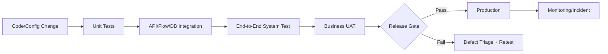

# Week 11 — Testing, UAT และ Operations

## บทนี้จะได้เรียนรู้อะไร

เมื่อจบบทนี้ ผู้เรียนสามารถวาง Test Plan, แยก unit/integration/UAT, ทดสอบ RLS/API/Storage/SLA, ทำ regression และ load checks, จัดระดับ incident, เก็บ test evidence, ขอ UAT sign-off และดูแล runbook หลัง go-live ได้

## ปัญหาที่ต้องการแก้

Checklist ที่ติ๊กผ่านโดยไม่มี test evidence ไม่บอกว่าระบบใช้งานได้จริง CMMS ต้องทดสอบทั้ง happy path และกรณีผิดพลาด เช่น duplicate, unauthorized, token expired, network failure, SLA calculation และ backup restore รวมถึงให้ business owner ยืนยันว่า workflow ตรงกับงานจริง

## แนวคิดพื้นฐาน

### Testing Levels

| ระดับ | ตรวจอะไร | ผู้รับผิดชอบ |
| --- | --- | --- |
| Unit | function/formula/query เล็ก ๆ | Developer |
| Integration | API/Flow/DB/Storage เชื่อมกัน | Developer/Tester |
| System | workflow End-to-End | QA |
| UAT | ตรงกับ business process | Business Owner |
| Regression | ของเดิมยังไม่พัง | QA/CI |
| Performance | latency/volume/concurrency | Engineer |

### Test Case และ Evidence

Test case ที่ดีมี ID, scenario, precondition, steps, expected/actual result, status, owner, timestamp และ evidence link ไม่ควรเขียน “ผ่าน” โดยไม่มีข้อมูลที่ตรวจสอบย้อนกลับได้

### Severity และ Incident

| Severity | ตัวอย่าง | การตอบสนอง |
| --- | --- | --- |
| Sev 1 | สร้าง/อ่าน Ticket ไม่ได้ทั้งระบบ หรือข้อมูลรั่ว | page on-call ทันที, incident commander |
| Sev 2 | Site/role สำคัญใช้งานไม่ได้ | แก้ภายใน SLA พร้อม workaround |
| Sev 3 | function บางส่วนผิดแต่มี workaround | จัดคิวแก้ตาม release |
| Sev 4 | cosmetic/documentation | backlog ปกติ |

## Architecture



### Test Data Flow

1. สร้างข้อมูลจำลองที่ควบคุมได้และไม่ใช้ PII จริง
2. รัน unit/integration ใน CI หรือ Development
3. รัน system/UAT ใน Test environment ที่ใกล้ Production
4. เก็บผลและ defect link เป็น evidence
5. แก้ defect → retest → regression → sign-off
6. หลัง release monitor smoke test และ incident path

## Step-by-Step

### 1. สร้าง Test Plan

กำหนด scope, out of scope, environment, test data, roles, entry/exit criteria, risk, owners และ schedule โดยผูกกับ requirements/acceptance criteria ไม่ใช่ทดสอบตามความรู้สึก

### 2. สร้าง Test Matrix

```text
Feature: Create Ticket
Positive: valid requester creates ticket
Validation: missing description/site/priority
Authorization: another user cannot edit reporter's ticket
Reliability: duplicate submit/network failure
Integration: notification/status history created
Analytics: reporting view count includes the ticket once
```

### 3. ทดสอบ RLS และ Security

ใช้ requester/technician/supervisor/manager test user เรียก endpoint โดยตรง ตรวจ row/operation ที่ได้ และทดสอบ token expired, role escalation, file access, rate limit และ secret scan

### 4. ทดสอบ Workflow End-to-End

สร้าง Critical Ticket → Approval → Assignment → Accepted → In Progress → Waiting Material → Completed → Verified → Closed และยืนยัน timestamps/history/notification ทุกจุด

### 5. UAT Session

ให้ business owner ใช้ scenario จริง เช่น MDB, pump, vendor, Before/After photo, SLA escalation และ asset history บันทึกข้อสังเกต แยก defect กับ change request แล้วให้ sign-off ตาม acceptance criteria

### 6. Performance และ Failure Tests

วัด p95 latency ของ search/pagination, จำนวน concurrent request ที่คาดหมาย, Flow duration, photo upload success และ behavior เมื่อ database/API/storage/Power BI unavailable ห้ามใช้ load test กับ Production โดยไม่มีอนุมัติ

### 7. Incident Runbook

1. Detect และสร้าง incident ID
2. ประเมิน impact/severity
3. แต่งตั้ง incident owner/communicator
4. Mitigate ด้วย feature flag/workaround/rollback ตามเกณฑ์
5. เก็บ timeline และ evidence
6. Restore service และตรวจ data integrity
7. ทำ post-incident review/root cause/action items

## ตัวอย่าง Code และ Test Case

### SQL Data Integrity Test

```sql
-- Ticket ที่มี asset ต้องอ้าง Site เดียวกับ Asset
select t.ticket_number
from public.tickets t
join public.assets a on a.id = t.asset_id
where t.site_id <> a.site_id;
```

ผลลัพธ์ที่คาดหวังคือไม่มี row หากมี row ต้อง block release หรือจัดเป็น data defect

### API Negative Test

```javascript
pm.test("unauthorized request is rejected", function () {
  pm.expect(pm.response.code).to.be.oneOf([401, 403]);
});
```

### UAT Sign-off Record

```text
UAT ID: UAT-2026-001
Scope: Repair Request to Closed Work Order
Business Owner: Maintenance Supervisor
Result: Passed with 2 accepted minor defects
Evidence: test-runs/UAT-2026-001/
Decision: Approved for release
```

## Use Case จริง: UAT ปิด Work Order

- **Actor:** Technician และ Supervisor
- **Preconditions:** Work Order มีผลซ่อมและรูป After Repair
- **Trigger:** Technician กด Completed
- **Input:** repair_result, cost/time, After photo และ note
- **Main Flow:** validate → Completed → Supervisor review → Verified → Closed
- **Alternative Flow:** หลักฐานไม่ครบ → ส่งกลับ In Progress พร้อมเหตุผล
- **Exception Flow:** RLS deny, photo upload fail, duplicate submit, network failure
- **Business Rule:** ผู้ทำงานไม่ใช่ผู้ตรวจรับคนเดียวกันเมื่อ policy แยกหน้าที่
- **Data Used:** work_orders, tickets, repair_photos, status_history, audit_logs
- **Security:** role separation, RLS, signed URL และ audit trail
- **Acceptance Criteria:** ปิดงานไม่ได้หากไม่มี required evidence และ history ครบ
- **KPI:** UAT Pass Rate, Closure Rework Rate และ Defect Escape Rate

## แบบฝึกหัด

### Exercise 1 — Test Case Design

1. **เป้าหมาย:** เขียน test ครบ positive/negative/security/reliability
2. **สิ่งที่ต้องเตรียม:** requirements, RLS matrix, API contract และ status workflow
3. **ขั้นตอน:** แตก acceptance criteria เป็น cases, กำหนด data/owner/evidence
4. **Code:** ใช้ SQL/API tests ในบทนี้
5. **Expected Result:** ไม่มี requirement สำคัญที่ไม่มี test mapping
6. **วิธีตรวจสอบ:** ทำ traceability matrix
7. **ปัญหา:** test ซ้ำหรือ expected ไม่วัดผลได้
8. **วิธีแก้ไข:** ใช้ observable result และ unique test ID
9. **Challenge:** เพิ่ม property-based test สำหรับ priority/status values

### Exercise 2 — Incident Drill

จำลอง API 500 หรือ storage unavailable ระหว่าง Field Work บันทึก incident timeline, severity, mitigation, communication และ recovery validation

## Mini Project: CMMS UAT and Operations Pack

### Requirement

สร้าง Test Plan, Test Case suite, UAT checklist, defect log, incident runbook และ production smoke test สำหรับ CMMS

### User Story

ในฐานะ Business Owner ฉันต้องการเห็นหลักฐานว่าระบบตรงกับ workflow และสามารถรับมือ failure ก่อน sign-off ได้

### Acceptance Criteria

- ทุก functional requirement มี test mapping
- มี positive/negative/security/reliability cases
- UAT ใช้ scenario จากงานจริงและมี owner/sign-off
- RLS/API/Storage/SLA/Power BI/Backup ถูกทดสอบ
- Incident severity/runbook มีคนทำตามได้
- defect ที่ block release ถูกจัดการหรือได้รับการยอมรับอย่างเป็นทางการ

### Data Model

`test_cases`, `test_runs`, `defects`, `uat_signoffs`, `incidents` และ evidence repository แบบไม่เก็บ secret/PII เกินจำเป็น

### Workflow

Requirement → Test Design → Execute → Defect → Fix → Retest/Regression → UAT Sign-off → Release Smoke → Operations

### Implementation Steps

1. สร้าง traceability matrix
2. เติม test cases จาก `docs/testing/test-cases.md`
3. เพิ่ม role/security/API/storage tests
4. สร้าง UAT scenarios
5. ทำ incident/restore drill
6. เก็บ evidence และ defect status
7. ทำ release gate review

### Test Cases

Create Ticket, Required Field, Invalid Type, Duplicate, Unauthorized, Assignment, Status Transition, Photo, RLS, API Auth, Token Expired, Network Failure, SLA, Closure, Power BI Refresh และ Backup Restore

### Expected Output

Test Plan, test evidence, defect log, UAT sign-off, incident runbook และ post-release smoke checklist

### Definition of Done

Business owner sign-off ครบ, release blockers ไม่มี, known defects มี owner/acceptance, operations มี runbook และผลทดสอบเก็บตาม retention

## Common Mistakes

- ทดสอบเฉพาะ happy path
- ใช้ข้อมูล Production ใน UAT โดยไม่ mask
- ให้ผู้พัฒนาคนเดียว sign-off ธุรกิจ
- ไม่มี test evidence/actual result
- ปิด defect เพราะ workaround โดยไม่บันทึก risk
- ไม่ทดสอบ RLS direct API
- ไม่มี regression หลังแก้ policy/migration
- incident runbook ไม่มี owner/เวลาอัปเดต

## Best Practices

- trace requirement → test → evidence → defect → sign-off
- แยก test data และใช้ deterministic IDs
- security/negative tests เป็น release gate
- ทดสอบ restore และ external dependencies
- กำหนด severity/SLA/escalation
- สื่อสาร known limitation และ monitor หลัง release

## Troubleshooting

| อาการ | สาเหตุที่พบบ่อย | วิธีแก้ |
| --- | --- | --- |
| test ผ่านแต่ UAT fail | scenario ไม่ตรง business | เพิ่ม representative workflow และ owner review |
| defect reproduce ไม่ได้ | data/environment ไม่คงที่ | บันทึก version, input, role และ timestamp |
| RLS test ผ่าน UI แต่ direct API fail | UI ซ่อน behavior | ทำ API-level security test |
| UAT sign-off ช้า | scope/decision owner ไม่ชัด | กำหนด entry/exit/owner และ calendar |
| incident แก้แล้วเกิดซ้ำ | ไม่มี root cause/action | post-incident review และ preventive action |

## Checklist

- [ ] Test Plan/scope/entry-exit criteria
- [ ] Unit/integration/system/UAT coverage
- [ ] RLS/API/Storage/security tests
- [ ] Negative/reliability/performance tests
- [ ] Traceability/evidence/defect log
- [ ] UAT sign-off
- [ ] Severity/incident runbook
- [ ] Smoke/regression test
- [ ] Known limitations/support handover

## สรุป

Week 11 ทำให้คุณภาพเป็นกระบวนการที่ตรวจสอบได้ ตั้งแต่ requirement ถึง UAT และ operations การ release ที่รับผิดชอบต้องรู้ทั้งสิ่งที่ผ่าน, สิ่งที่ไม่ผ่าน, risk ที่ยอมรับ และวิธีรับมือเมื่อระบบทำงานไม่ตามคาด

## คำถามทบทวน

1. Unit, integration และ UAT ต่างกันอย่างไร
2. Test evidence ที่ดีควรมีอะไร
3. ทำไมต้องทดสอบ RLS แบบ direct API
4. Severity ต่างจาก priority อย่างไร
5. UAT sign-off ควรเป็นของใคร
6. Regression test ใช้เมื่อใด
7. ทำไมต้องทดสอบ backup restore
8. Incident runbook ควรเริ่มจากอะไร
9. Known defect ควรจัดการอย่างไร
10. Release gate ควร block เมื่อใด
