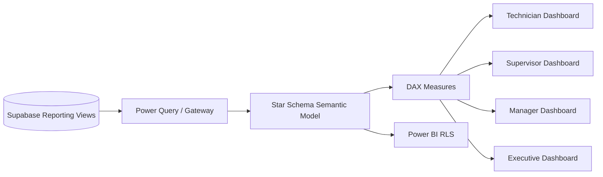

# Week 12 — Power BI Analytics และ Final Project

## บทนี้จะได้เรียนรู้อะไร

เมื่อจบบทนี้ ผู้เรียนสามารถเชื่อม Power BI กับ PostgreSQL/Supabase reporting layer, ออกแบบ star schema, สร้าง fact/dimension/date tables, เขียน DAX KPI, ทำ drillthrough/tooltip/mobile layout, กำหนด Power BI RLS และนำเสนอ CMMS Final Project แบบ End-to-End ได้

## ปัญหาที่ต้องการแก้

ข้อมูลจำนวนมากไม่ได้ช่วยการตัดสินใจถ้าไม่มี metric definition และ model ที่ดี Dashboard ที่นับ Ticket ซ้ำ, ใช้ average ผิด grain หรือเปิดข้อมูลให้ผู้บริหารเกินสิทธิ์จะทำให้การบริหารงานซ่อมผิดทิศ Week 12 จึงเชื่อม operational data กับ decision-ready analytics และรวม artefacts ทั้งหลักสูตรเป็น Capstone

## แนวคิดพื้นฐาน

### Import, DirectQuery และ Incremental Refresh

| Mode | จุดเด่น | ข้อจำกัด |
| --- | --- | --- |
| Import | เร็วและทำ model/DAX ได้ดี | ต้อง refresh และมี data copy |
| DirectQuery | เห็นข้อมูลใกล้ real time | latency/ข้อจำกัด query source |
| Incremental Refresh | ลดเวลาสำหรับข้อมูลประวัติ | ต้องออกแบบ date policy/partition |

เลือกตาม freshness, volume, network, licensing และ governance ไม่ใช่ใช้ mode เดียวกับทุกองค์กร

### Star Schema

Fact table มี grain ชัด เช่นหนึ่งแถวต่อ Work Order ส่วน dimension อธิบาย Date, Asset, Site, Technician, Vendor และ Problem Category ความสัมพันธ์ควรเดินจาก dimension ไป fact เป็นหลักเพื่อให้ filter context คาดเดาได้

### KPI Definitions

| KPI | Definition ตัวอย่าง | ข้อควรระวัง |
| --- | --- | --- |
| Backlog | งานที่ยังไม่ Closed/Cancelled ณ เวลา snapshot | status definition/timezone |
| SLA Compliance | งานที่ทำเสร็จตาม due_at ÷ งานที่มี due_at | exclude incomplete data อย่างไร |
| MTTR | ค่าเฉลี่ย start-to-complete ของงานที่เสร็จ | grain/negative duration |
| MTBF | เวลาทำงานระหว่าง failure ของ Asset | ต้องมี failure event ที่เชื่อถือได้ |
| Repeat Failure | Asset/category ซ้ำในช่วงเวลาที่กำหนด | window และ root cause |

## Architecture



### Data Flow

1. PostgreSQL/Supabase view สร้าง reporting contract
2. Power Query ดึงข้อมูลและกำหนด type/transform
3. Model แยก fact/dimension และสร้าง Date table
4. DAX คำนวณ KPI ตาม filter context
5. Report แบ่งหน้าและ audience พร้อม RLS/mobile layout
6. Refresh/quality checks ตรวจยอดกับ source และ monitor failure

## Step-by-Step

### 1. กำหนด Fact Grain

เลือก `Fact Work Order` หนึ่งแถวต่อ Work Order และเก็บ dimension keys, reported/started/completed dates, status, SLA flag, repair cost, downtime และ technician key อย่าใส่หลาย grain ใน fact เดียวโดยไม่บอกความหมาย

### 2. สร้าง Dimensions

สร้าง `Dim Date`, `Dim Asset`, `Dim Site`, `Dim Technician`, `Dim Vendor` และ `Dim Problem Category` พร้อม surrogate key/attribute ที่ใช้ filter และ drillthrough

### 3. เชื่อม Reporting View

ใช้ `power-bi/power-query/cmms-query.pq` เป็นจุดเริ่มต้น ตั้ง type ให้ถูก ตรวจ null/invalid dates และไม่โหลด column ที่ dashboard ไม่ใช้ ป้องกัน query source ที่ดึงข้อมูลทั้งหมดเกินจำเป็น

### 4. สร้าง DAX Measures

```DAX
Total Repair Requests = COUNTROWS('Fact Work Order')

Open Work Orders =
CALCULATE(
    [Total Repair Requests],
    'Fact Work Order'[Status] IN {"new", "submitted", "assigned", "in_progress"}
)

SLA Compliance % =
DIVIDE(
    CALCULATE([Total Repair Requests], 'Fact Work Order'[SLA Met] = TRUE()),
    CALCULATE([Total Repair Requests], NOT ISBLANK('Fact Work Order'[SLA Met]))
)

MTTR Hours =
AVERAGEX(
    FILTER('Fact Work Order', NOT ISBLANK('Fact Work Order'[Completed At])),
    DATEDIFF('Fact Work Order'[Started At], 'Fact Work Order'[Completed At], HOUR)
)
```

ทุก measure ต้องมี definition, filter context, owner และ expected validation query ไม่ควร copy DAX โดยไม่ตรวจ column type/relationship

### 5. ออกแบบ Dashboard ตาม Audience

- **Technician:** My Work, priority, aging, today queue
- **Supervisor:** backlog, SLA risk, workload, status funnel
- **Maintenance Manager:** MTTR/MTBF, repeat failure, cost/site/vendor
- **Executive:** monthly trend, downtime, critical asset, investment signal

ใช้ drillthrough ไป Asset/Ticket detail, tooltip อธิบาย definition และ mobile layout ที่ไม่ต้อง scroll ตารางกว้างเกินไป

### 6. Power BI RLS และ Refresh

ใช้ role mapping เช่น technician เห็น Site/งานตาม assignment, manager เห็น Site ที่รับผิดชอบ และ executive เห็น aggregated data ตาม governance ทดสอบ role ใน Power BI และ database/RLS ให้ไม่ขัดกัน ตั้ง refresh owner, gateway/credential policy และ failure alert

### 7. Final Project Presentation

นำเสนอ requirement → architecture → ERD → database/RLS → API → Power Apps/Flow → photo workflow → testing/UAT → Power BI → deployment/operations โดยสาธิต path จริงจาก Ticket ถึง Dashboard

## ตัวอย่าง Code และ Validation

### SQL Reconciliation กับ Power BI

```sql
-- ตรวจจำนวน Open Work Orders จาก source ก่อนเทียบกับ card ใน Power BI
select count(*) as open_work_orders
from public.tickets
where deleted_at is null
  and status in ('new','submitted','assigned','in_progress');
```

### KPI Documentation Template

```text
KPI: SLA Compliance %
Owner: Maintenance Manager
Numerator: Work Orders with SLA Met = true
Denominator: Work Orders with a non-null SLA result
Refresh: Daily 06:00 site time
Known limitation: records without due_at are excluded
```

## Use Case จริง: Executive Review งานซ่อมรายเดือน

- **Actor:** Executive, Maintenance Manager และ Power BI
- **Preconditions:** reporting view, model, DAX และ refresh ผ่าน
- **Trigger:** monthly performance review
- **Input:** date/site/asset/vendor filters และ KPI definitions
- **Main Flow:** ดู trend → drill Site/Asset → ตรวจ MTTR/MTBF → ตัดสินใจงบ/maintenance strategy
- **Alternative Flow:** refresh ล้มเหลว → แสดง last refresh time และ escalation ไม่แสดงตัวเลขสดที่ไม่สมบูรณ์
- **Exception Flow:** model relationship ผิด, source data missing, RLS mismatch
- **Business Rule:** executive view ไม่เปิด PII/รูปหน้างานเต็มโดยไม่จำเป็น
- **Data Used:** Fact Work Order, Repair Cost, Downtime และ dimensions
- **Security:** Power BI RLS, source RLS, workspace role และ export policy
- **Acceptance Criteria:** KPI ตรงกับ reconciliation query และ dashboard อ่านได้บน mobile
- **KPI:** MTTR, MTBF, SLA Compliance, Downtime, Cost และ Repeat Failure

## แบบฝึกหัด

### Exercise 1 — Star Schema

1. **เป้าหมาย:** ออกแบบ fact/dimension และกำหนด grain
2. **สิ่งที่ต้องเตรียม:** reporting view และ KPI list
3. **ขั้นตอน:** ระบุ grain, keys, relationships, date role และ measures
4. **Code:** ใช้ DAX/SQL examples ในบทนี้
5. **Expected Result:** filter Site/Asset/Date ทำงานโดยไม่เกิด many-to-many ที่ไม่ตั้งใจ
6. **วิธีตรวจสอบ:** compare row counts และ cross-filter test
7. **ปัญหา:** measure นับซ้ำหรือ date filter ไม่ทำงาน
8. **วิธีแก้ไข:** ตรวจ grain/relationship/active date relationship
9. **Challenge:** เพิ่ม downtime fact แยกจาก work order fact

### Exercise 2 — Executive KPI Review

สร้างหน้า dashboard ที่มี Backlog, SLA, MTTR, MTBF, Cost by Site และ Top Failure Assets พร้อม definition/last refresh/reconciliation evidence

## Mini Project: CMMS Power BI Dashboard และ Capstone

### Requirement

สร้าง Power BI Dashboard หลายระดับและส่ง Final Project End-to-End ที่รวม artefacts จาก 12 สัปดาห์

### User Story

ในฐานะ Maintenance Manager ฉันต้องการเห็น KPI ที่เชื่อถือได้และ drill ลงถึง Asset/Ticket เพื่อจัดลำดับการแก้ปัญหาและลงทุนได้ถูกต้อง

### Acceptance Criteria

- Star schema และ grain documented
- KPI measures มี definition/owner/validation
- Dashboard มี Technician/Supervisor/Manager/Executive views
- Power BI RLS และ source RLS tested
- Refresh/last refresh/error monitoring documented
- Final demo ครบ create-to-close, photo, API, security, UAT และ operations

### Data Model

ใช้ `Fact Work Order`, `Fact Repair Cost`, `Fact Downtime`, `Dim Date`, `Dim Asset`, `Dim Site`, `Dim Technician`, `Dim Vendor` และ `Dim Problem Category`

### Workflow

Source View → Power Query → Star Schema → DAX → RLS → Dashboard → Reconcile → Present/Sign-off

### Implementation Steps

1. กำหนด KPI dictionary
2. สร้าง model/relationships
3. สร้าง date/asset/site/technician dimensions
4. สร้าง DAX measures
5. จัด dashboard ตาม audience
6. ทดสอบ RLS/mobile/drillthrough
7. reconcile กับ SQL
8. เตรียม capstone presentation และ production readiness pack

### Test Cases

Model Refresh, KPI Reconciliation, Date Filter, Site Filter, Drillthrough, Mobile Layout, Power BI RLS, Source RLS, Missing Data, Refresh Failure และ Export Permission

### Expected Output

Power BI dashboard, semantic model documentation, DAX/KPI dictionary, RLS test evidence และ Final Project presentation pack

### Definition of Done

ผู้เรียนสาธิตระบบ CMMS ตั้งแต่แจ้งซ่อมถึง dashboard, อธิบายข้อจำกัด/assumptions, ผ่าน security/UAT/operations review และส่งเอกสารครบตาม Final Project Requirements

## Common Mistakes

- ใช้ fact table หลาย grain โดยไม่แยก
- นับ Ticket ซ้ำจาก many-to-many
- ใช้ calculated column แทน measure โดยไม่เข้าใจ filter context
- KPI ไม่มี definition/owner/reconciliation
- ไม่จัดการ null/invalid dates
- Power BI RLS ไม่ตรงกับ source RLS
- dashboard แสดง PII/รูปหน้างานเกิน audience
- refresh fail แต่ยังแสดงตัวเลขเหมือนสด

## Best Practices

- กำหนด grain ก่อนสร้าง relationship
- ใช้ star schema และ single-direction filter เป็นค่าเริ่มต้น
- สร้าง measure จาก business definition
- แสดง last refresh/data quality indicator
- ทดสอบ RLS ด้วย test users/roles
- แยก executive summary กับ operational detail
- ใช้ mobile layout และ accessibility labels

## Troubleshooting

| อาการ | สาเหตุที่พบบ่อย | วิธีแก้ |
| --- | --- | --- |
| ยอดใน Power BI ไม่ตรง SQL | filter/grain/timezone ต่าง | ทำ reconciliation query และตรวจ model relationships |
| measure นับซ้ำ | many-to-many/relationship ผิด | ตรวจ grain, bridge table และ filter direction |
| refresh fail | credential/gateway/schema change | ตรวจ refresh history, contract และ owner |
| RLS เห็นข้อมูลเกิน | role mapping/model/source policy ผิด | ทดสอบแต่ละ layer และลด export permission |
| mobile อ่านยาก | visual กว้าง/ตัวอักษรเล็ก | ทำ mobile layout และลด visual ต่อหน้า |

## Checklist

- [ ] Star schema/grain
- [ ] Fact/Dimension/Date tables
- [ ] Power Query/data types
- [ ] DAX measures/KPI dictionary
- [ ] Drillthrough/tooltip/mobile
- [ ] Power BI RLS/source RLS
- [ ] Refresh/last refresh monitoring
- [ ] SQL reconciliation
- [ ] Final Project demo/docs
- [ ] Production readiness/sign-off

## สรุป

Week 12 เชื่อมข้อมูลเชิงปฏิบัติการกับการตัดสินใจ และปิดวงจรการเรียนรู้ด้วย Final Project ที่ตรวจได้ทั้ง architecture, database, security, API, application, analytics, testing และ operations Dashboard ที่ดีไม่ใช่เพียงสวย แต่ต้องมี definition, governance และหลักฐานว่าตัวเลขเชื่อถือได้

## คำถามทบทวน

1. Fact grain คืออะไร
2. Fact และ Dimension ต่างกันอย่างไร
3. Import กับ DirectQuery ต่างกันอย่างไร
4. ทำไมต้องมี Date table
5. Measure ต่างจาก calculated column อย่างไร
6. MTTR และ MTBF ต่างกันอย่างไร
7. ทำไมต้อง reconcile กับ SQL
8. Power BI RLS ต่างจาก source RLS อย่างไร
9. Dashboard แต่ละ audience ควรต่างกันอย่างไร
10. Final Project ถือว่าพร้อมส่งเมื่อใด
