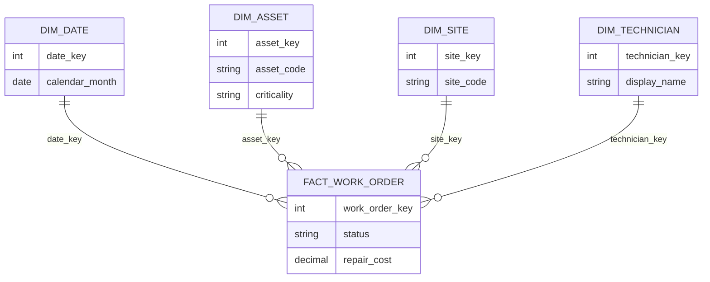

# CMMS Power BI Star Schema

```mermaid
erDiagram
  DIM_DATE ||--o{ FACT_WORK_ORDER : date_key
  DIM_ASSET ||--o{ FACT_WORK_ORDER : asset_key
  DIM_SITE ||--o{ FACT_WORK_ORDER : site_key
  DIM_TECHNICIAN ||--o{ FACT_WORK_ORDER : technician_key
  FACT_WORK_ORDER { int work_order_key string status decimal repair_cost }
  DIM_DATE { int date_key date calendar_month }
  DIM_ASSET { int asset_key string asset_code string criticality }
  DIM_SITE { int site_key string site_code }
  DIM_TECHNICIAN { int technician_key string display_name }
```

ใช้ `FACT_WORK_ORDER` เป็น grain หนึ่งแถวต่อ Work Order และแยก Date/Asset/Site/Technician เป็น dimension เพื่อให้ filter และ drillthrough คาดเดาได้
